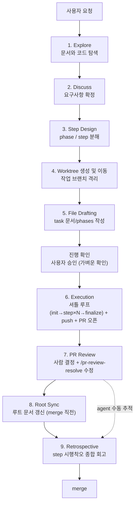
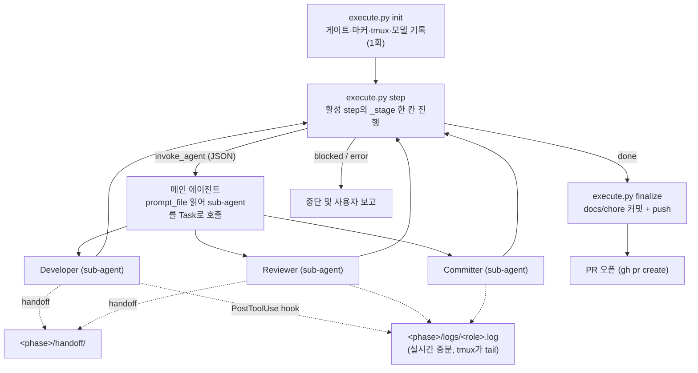

# harness-v3 요약

`harness-v3`는 개발을 바로 시작하기 전에 요청을 정리하고, 필요한 문서를 좁혀 읽고, step을 설계하고, 준비된 phase는 실행기까지 연결하는 하네스성 skill이다. `harness-v2`의 9-Stage 워크플로우를 그대로 계승하되, **agent 실행 계층을 `claude -p` subprocess에서 native sub-agent로 재설계**했다.

`Explore → Discuss → Step Design → Worktree 생성 및 이동 → File Drafting → Execution → PR Review → Root Sync → Retrospective` 9-Stage 흐름을 `workflow-checklist.json`으로 추적한다. 이 중 1~6번은 실행 과정에서 상태가 갱신되고, 7~9번은 phase 바깥에서 agent가 진행하며 수동으로 갱신한다. 이 문서는 상세 사용법이 아니라, 나중에 다시 봤을 때 "아 지금 이런 구조였지"를 빠르게 떠올리기 위한 요약 문서다.

## v2와의 차이 (핵심)

2026-06-15부터 구독 사용량과 프로그램적 사용(`claude -p`)의 과금이 분리되면서, v2의 `execute.py`가 `claude -p`로 agent를 직접 띄우는 방식은 비싼 종량 크레딧으로 빠졌다. v3는 **agent 실행을 대화형 세션 안의 native sub-agent로 옮겨 구독 한도 안에서 돌게** 한다. 단, native sub-agent는 Python 스크립트가 아니라 **대화형 메인 에이전트만** Task로 호출할 수 있다 — 이 제약이 v3 구조를 결정한다.

| | harness-v2 | harness-v3 |
| --- | --- | --- |
| agent 실행 | `execute.py`가 `subprocess.Popen`으로 `claude -p` 직접 | 메인 에이전트(셔틀)가 native sub-agent를 Task로 호출 |
| 과금 | 프로그램적 사용 → 종량 크레딧 | 대화형 세션 → 구독 한도 |
| execute.py 역할 | 끝까지 도는 오케스트레이터 | 게이트·판정·상태전이만, 다음 행동을 JSON으로 1줄 출력 |
| 결과 전달 | 자식 프로세스 stdout 캡처 | `<phase>/handoff/` 디스크 파일 (execute.py가 부모가 아니므로) |
| 완료 감지 | `proc.wait()` | Task 블로킹 + 핸드오프 파일 존재 확인 |
| 진행 주체 | execute.py 단독 | 메인 에이전트가 `step` ↔ sub-agent를 오가는 셔틀 루프 |

## 용어

- **Stage**: 9-Stage 워크플로우 전체의 진행 단계(1~9). `workflow-checklist.json`의 각 항목.
- **step**: phase 내부의 구현 작업 단위. 커밋 1개에 대응한다.
- **phase**: step들의 묶음이자 통합 사이클 단위. 기본은 Task당 1개(`0-main`)이고, 강한 선후 의존이나 중간 검증 가치가 있을 때만 여러 개로 나눈다.
- **셔틀(shuttle)**: 메인 에이전트가 `execute.py`(두뇌)와 sub-agent(일꾼) 사이를 오가며 지시를 운반하는 역할.

## 전체 흐름 (9-Stage)



Stage 6에서 PR을 한 번만 오픈하고, Stage 7~9는 같은 브랜치/같은 PR에 커밋·push를 더 쌓는다.

## Execution 내부 파이프라인 (Stage 6 — 셔틀 루프)



`execute.py step` 한 번은 로컬 Python이 phase index를 읽고 다음 행동을 JSON 한 줄로 내보낼 뿐이라 **모델 토큰을 쓰지 않는다**. 토큰을 쓰는 건 sub-agent 호출뿐이고 그 횟수는 v2와 동일하다(step당 developer + reviewer + committer, 재시도 포함). 상태는 전부 디스크(phase index의 `_stage`/`_attempt` + handoff)에 영속하므로, 세션 한도로 끊겨도 같은 명령 재실행이면 중단 지점부터 재개한다.

## 단계별 역할

### 1. Explore / Discuss

`CLAUDE.md`를 읽고 현재 Repo 규칙을 파악한다. Task 문서와 phase 문서를 우선 읽고, 부족한 공통 맥락이 있을 때만 루트 `docs/`를 추가로 읽는다. 요구사항이 모호하면 구현 전에 사용자와 논의한다.

**계획 전 루트 문서 정합성 확인(필수)**: 구현 방향을 제안하기 전에 agent가 먼저 기존 결정과의 충돌을 확인한다. `docs/adr.md`의 `Task ADR 색인` "주요 결정 키워드" 열을 훑어 관련 ADR을 식별하고(항상), 작업이 건드리는 영역에 따라 architecture/prd/db-schema/api-spec을 추가 확인한다. 제안은 "관련 결정/문서 + 선택지(정합 라벨)" 형식으로 제시한다.

### 2. Step Design

작업을 `docs/tasks/<task-name>/phases/<phase-name>/step{N}.md` 단위로 분해한다. phase는 통합 사이클 단위로, 기본 1개이며 선후 의존/중간 검증 가치가 있을 때만 나눈다.

### 3. Worktree 생성 및 이동

Step Design 완료 후 작업 브랜치 worktree를 생성하고 이동한다.

```bash
cd "$(git rev-parse --git-common-dir)/.."
git worktree add worktrees/<type>-<task-name> -b <type>/<task-name> develop
cd worktrees/<type>-<task-name>
```

`git worktree add`와 `cd` 이동이 모두 완료돼야 이 Stage가 완료다. 이동 직후 `pwd` 또는 `git branch --show-current`로 확인한다.

### 4. File Drafting

worktree 안에서 Task 문서와 phase 구조를 작성한다. Task 문서는 그 Task가 실제로 건드리는 관심사만 선택 생성한다. phase index에는 `harness_version: "v3"`를 박는다(아래 "harness_version" 참고). 작성 완료 후 반드시 멈추고 문서 경로를 보고한다.

### 5. Execution 진입 룰

`execute.py` 실행 전 사용자 진행 확인을 가벼운 확인으로 받는다(별도 Plan Mode 절차는 거치지 않는다). 승인이 확정되면 File Drafting 결과물(Task 문서 + phase 초안)을 `docs:` 커밋으로 등록하고, `AskUserQuestion`으로 agent별 실행 모델(developer / reviewer / commit)을 수집한다. 자세한 절차는 SKILL.md Stage 6 참고.

### 6. Execution (셔틀 루프)

승인 후 메인 에이전트가 아래 루프를 돈다.

- **init**: `execute.py init <phase> --developer-model ... --reviewer-model ... --commit-model ...`로 게이트(checklist 승인)·worktree 검증·마커(`.harness/active-phase`)·tmux·모델 기록을 1회 수행한다.
- **step (반복)**: `execute.py step <phase>`가 활성 step의 `_stage`를 한 칸 진행하고 다음 행동을 JSON으로 STDOUT에 한 줄 낸다(사람용 로그는 STDERR). `invoke_agent`면 메인 에이전트가 `prompt_file`을 읽어 해당 sub-agent(`harness-v3-developer` / `harness-v3-reviewer` / `harness-v3-committer`)를 Task로 호출하고, 끝나면 다시 `step`을 부른다.
  - **Developer**: 구현·테스트. 컨텍스트로 핵심 코딩 컨벤션(logging / exception / testing / **package-structure**)의 `## 핵심 원칙 (요약)`이 **항상 주입**되고, 불확실하면 전문을 Read한다. 작업 마지막에 `stepN-dev.json` 핸드오프를 쓴다. index는 건드리지 않는다.
  - **Verifier / AC**: `execute.py`가 dev 핸드오프(구조)와 Acceptance Criteria 재실행 결과(객관 게이트)를 본다. dev의 자기보고 `ok`는 약한 신호, AC 재실행이 진짜 게이트다.
  - **Reviewer**: read-only 검토. `approved`(기본) / `retryable_error`(한 문장으로 짚히는 명백한 결함) / `blocked`(사람 필요) 중 하나를 `stepN-review.json`에 쓴다. dev의 `struggles`(ADR 일탈)도 판정한다.
  - **Committer**: `git status`/`diff`로 확인 후 commit-conventions.md 기준으로 목적별 분리 커밋(코드 → docs:). 핸드오프 없음 — `execute.py`가 git HEAD 변화로 커밋 여부를 확인한다(B안: 커밋 생성 또는 트리 깨끗이면 통과).
- **finalize**: `done`이면 `execute.py finalize <phase>`가 잔여 Task 문서 `docs:` 커밋, phase index 두 개 `chore:` 커밋, 원격 push(기본, `--no-push`로 생략)를 한다.
- 이어서 PR 오픈(`gh pr create`)은 `execute.py` 바깥에서 메인 에이전트가 수행한다.

각 agent의 모델은 SKILL.md Stage 6에서 `AskUserQuestion`으로 수집한 값이며 phase index의 `execution` 필드에 1회 기록된다. 기본값은 developer=`sonnet`, reviewer=`opus`, commit=`haiku`.

재시도(`retryable_error` 또는 검증 실패)는 `execute.py`가 같은 step을 최대 3회 다시 돌린다. `_stage`를 `need_developer`로 되돌리고 `_prev_error`를 다음 developer 프롬프트에 주입한다. 최종 `blocked`/`error`는 자동 복구하지 않고 사용자 승인을 기다린다.

### 7. PR Review

Stage 6에서 오픈한 PR의 review 코멘트를 처리한다. 사람이 항목별 처리 방향(accept / reject / modify)을 결정하고, 코드 수정·답변·resolve는 `/pr-review-resolve <PR번호>` 스킬이 항목별 커밋·push까지 자체 수행한다.

### 8. Root Sync

PR review까지 코드가 확정된 시점에 루트 문서를 현재 상태로 갱신한다(merge 직전, 멱등 재실행 가능).

- **ADR**: append. Task ADR에서 새로 채택된 결정만 루트 전역 번호로 이어붙인다. 대체 시 `supersedes` 표시.
- **architecture / db-schema / api-spec**: 루트 현재 파일 기준으로 이번 변경분만 반영. 안 바뀐 부분은 보존.
- **루트 PRD**: 기능 목록에 요약 한 줄 + Task PRD 링크만 추가/갱신.

### 9. Retrospective

이번 작업 전체에서 얻은 교훈을 회고록으로 남긴다. `stepN-output.json`의 `attempts[]`에 누적된 step별 시행착오(`{attempt, ok, struggles}`)를 종합한다. merge 직전 1회 작성한다.

## 핸드오프와 마커 (v3 신규)

`execute.py`는 sub-agent의 부모 프로세스가 아니므로, 결과를 디스크 파일로만 주고받는다.

- **handoff** (`<phase>/handoff/`): sub-agent → execute.py 결과 전달 통로(휘발성). developer는 `stepN-dev.json`{step, attempt, ok, summary, struggles}, reviewer는 `stepN-review.json`{step, decision, message}를 마지막 행동으로 쓴다. committer는 안 쓴다. `execute.py`가 각 호출 전 동적 프롬프트(`stepN-*-prompt.md`)도 여기 쓴다.
- **`.harness/`** (worktree 루트): harness 실행 중에만 쓰는 내부 상태 폴더. `.gitignore`로 제외(`/.harness/`)되는 로컬 산출물이다. 안에 두 가지를 둔다.
  - **`active-phase`** (마커): `init`이 현재 phase 상대경로를 한 줄 적고 `finalize`가 지운다. 로깅 hook(PostToolUse·SubagentStop)이 이걸 읽어 로그를 `<phase>/logs/`에 쓴다.
- **logstate** (`.harness/logstate-<agent_id>.json`): 증분 로깅의 북마크(이미 찍은 메시지 키 + 헤더 여부). PostToolUse가 갱신하고 SubagentStop이 sub-agent 종료 시 지운다. 지우는 이유: agent_id가 재사용돼도 옛 북마크가 새 실행 메시지를 '이미 찍었다'고 오인해 누락하는 걸 막고, `.harness/`에 파일이 쌓이지 않게 하기 위함. (claude code가 만드는 transcript와는 별개로 우리가 만드는 파일이다.)

## 로그 산출물 (`logs/`) — 실시간 증분

phase 폴더 아래 `logs/`에 sub-agent별 사람용 로그를 쌓는다: `harness-v3-developer.log` / `harness-v3-reviewer.log` / `harness-v3-committer.log`.

실시간성은 **PostToolUse hook**으로 얻는다. sub-agent가 도구를 쓸 때마다 `log_progress.sh`가 그 sub-agent의 transcript(.jsonl)에서 **새로 확정된 부분만** 골라 로그에 append한다. 백그라운드 프로세스(tail)를 띄우지 않으므로 좀비 프로세스가 없고, 상태파일(`.harness/logstate-<id>.json`)의 '이미 찍은 키'로 재출력을 막아 중복이 없다. transcript는 스트리밍 중 같은 `requestId`로 누적 기록되는데, 포맷터가 키별 마지막(가장 완성된) 엔트리만 남겨 dedup한다. 마지막(진행 중일 수 있는) 메시지는 보류했다가 다음 PostToolUse나 SubagentStop에서 flush한다.

- **PostToolUse → `log_progress.sh`**: 도구 경계마다 증분 append (실시간)
- **SubagentStop → `log_stop.sh`**: 보류분 마지막 flush + 완료 박스 + 상태파일 정리
- tmux 3-pane이 이 로그를 `tail -f`해 실시간 표시

내용 면에선 v2와 동일하게 사고·도구 입출력·결과가 다 남는다(누락 없음). 다른 점은 갱신 단위가 토큰이 아니라 **도구 경계**라는 것뿐이다. `logs/`는 `.gitignore`로 제외되는 로컬 산출물이다.

## tmux 3-pane 관찰

`$TMUX` 세션 안이면 `execute.py init`이 현재 pane을 좌우로 나눠(왼쪽 = 메인 세션) 오른쪽을 3등분해 developer / reviewer / committer 로그를 `tail -f`한다. pane title은 `harness-v3:<role>`. `$TMUX` 밖이면 콘솔 출력으로 degrade한다.

## 권한·환경 주의

- sub-agent 정의(`.claude/agents/harness-v3-*.md`)에 `permissionMode: bypassPermissions`가 있어 무인 실행된다. 단 **메인 세션이 `auto` 모드면 frontmatter가 무시**되므로, 메인 세션은 `default` 또는 `bypassPermissions`로 실행한다.
- `CLAUDE_CODE_SUBAGENT_MODEL` 환경변수가 설정돼 있으면 init에서 고른 모델을 덮어쓴다. 모델 선택을 그대로 쓰려면 미설정 상태여야 한다(대부분 기본 미설정).
- PreToolUse 차단이 sub-agent에서 무시될 수 있다(이슈 #40580, WSL 라벨). hook은 2차 방어(defense-in-depth)이고, 각 agent `.md`의 프롬프트 제약이 baseline이다.

## harness_version

`harness-v3`로 설계된 작업임을 표시하기 위해 `harness_version: "v3"`를 task `phases/index.json`의 **각 phase 항목**과 phase `index.json` **top-level** 양쪽에 둔다. `execute.py`가 실행 전 둘 다 확인해 구버전 phase로 v3를 실행하는 혼선을 막는다. (`workflow-checklist.json`의 `workflow`는 공통으로 `"harness"`다 — 방법론 이름이므로.)

## 비용 관점 (v2 #213의 해소)

v2는 `execute.py`가 `claude -p`로 agent를 실행해 2026-06-15 과금 분리에 직접 노출됐다. v3는 sub-agent를 대화형 세션 안에서 돌려 **구독 한도 안으로 되돌린 것이 핵심 목적**이다. sub-agent 호출 횟수(step당 3회 + 재시도)는 v2와 같고, 추가된 `execute.py step` 호출은 로컬 Python이라 토큰 0이다. 즉 v3는 같은 작업량을 구독으로 처리한다.

## 현재 Repo의 역할별 구성

- Workflow policy: `.claude/skills/harness-v3/SKILL.md`
- Phase file reference: `.claude/skills/harness-v3/references/phase-files.md`
- Orchestration(두뇌): `.claude/skills/harness-v3/scripts/execute.py` (init/step/finalize, _stage 상태기계, tmux 3-pane, 마커·핸드오프, 프롬프트 빌드, AC 재검증, HEAD 확인)
- Context Manager: `.claude/skills/harness-v3/scripts/step_context.py` (Task 문서 + 핵심 코딩 컨벤션 요약 주입, package-structure 포함)
- Verifier / AC 재검증: `.claude/skills/harness-v3/scripts/step_verifier.py`, `acceptance_runner.py`
- Log Formatter: `.claude/skills/harness-v3/scripts/format_events.py`, `transcript_formatter.py`
- Git helper: `.claude/skills/harness-v3/scripts/git_ops.py`
- Sub-agent 정의: `.claude/agents/harness-v3-developer.md`, `harness-v3-reviewer.md`, `harness-v3-committer.md`
- 로깅 hook: `.claude/skills/harness-v3/scripts/hooks/log_progress.sh` (PostToolUse, 실시간 증분) + `log_stop.sh` (SubagentStop, 마지막 flush)
- PreToolUse 정책: `.claude/hooks/pre_tool_use_policy.py` (repo 공용 — 블랙리스트 + committer 화이트리스트 + reviewer Write 가드)

v2에서 쓰던 `agent_runner.py` / `developer_agent.py` / `reviewer_agent.py` / `commit_agent.py` / `developer_guardrails.py` / `reviewer_guardrails.py`는 v3에서 사라졌다(프롬프트는 agent `.md`로, HEAD 확인·프롬프트 빌드는 `execute.py`로 이동).
