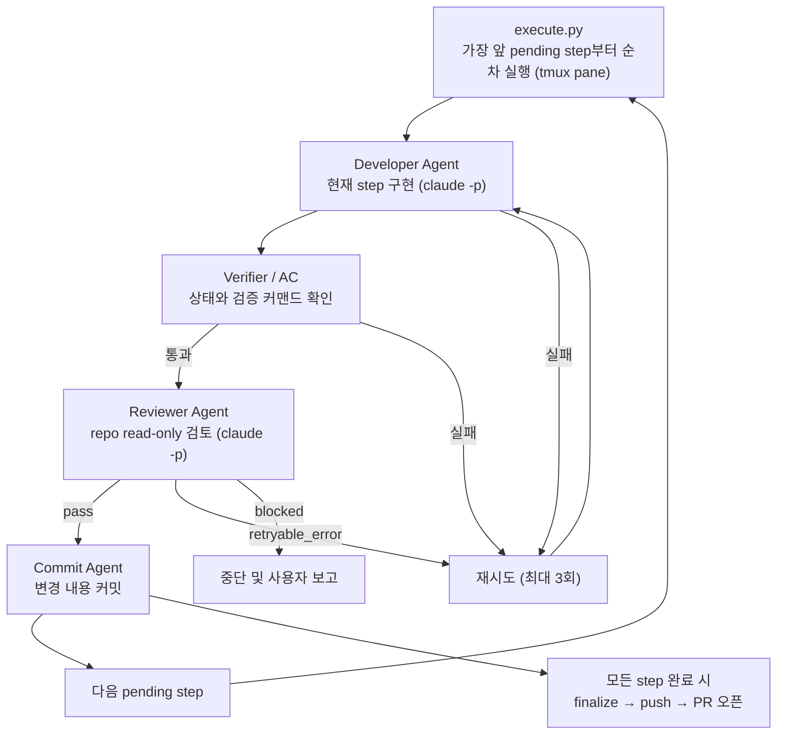

# harness 요약

`harness`는 개발을 바로 시작하기 전에 요청을 정리하고, 필요한 문서를 좁혀 읽고, step을 설계하고, 준비된 phase는 실행기까지 연결하는 하네스성 skill이다.

지금 이 Repo 기준으로 보면 `Explore → Discuss → Step Design → Worktree 생성 및 이동 → File Drafting → Execution → PR Review → Root Sync → Retrospective` 9-Stage 흐름을 `workflow-checklist.json`으로 추적한다. 이 중 1~6번은 `execute.py`가 자동으로 상태를 갱신하고, 7~9번은 phase 바깥에서 agent가 진행하며 수동으로 갱신한다. 이 문서는 상세 사용법이 아니라, 나중에 다시 봤을 때 "아 지금 이런 구조였지"를 빠르게 떠올리기 위한 요약 문서다.

## 용어

- **Stage**: harness workflow 전체의 진행 단계(1~9). `workflow-checklist.json`의 각 항목.
- **step**: phase 내부의 구현 작업 단위. 커밋 1개에 대응하며 `execute.py`가 실행한다.
- **phase**: step들의 묶음이자 통합 사이클 단위. 기본은 Task당 1개(`0-main`)이고, 강한 선후 의존이나 중간 검증 가치가 있을 때만 여러 개로 나눈다.

## 전체 흐름 (9-Stage)

```mermaid
flowchart TD
    A["사용자 요청"] --> S1["1. Explore<br>문서와 코드 탐색"]
    S1 --> S2["2. Discuss<br>요구사항 확정"]
    S2 --> S3["3. Step Design<br>phase / step 분해"]
    S3 --> S4["4. Worktree 생성 및 이동<br>작업 브랜치 격리"]
    S4 --> S5["5. File Drafting<br>task 문서/phases 작성"]
    S5 --> O["Plan Mode + ExitPlanMode<br>사용자 진행 확인"]
    O --> S6["6. Execution<br>execute.py 순차 실행 + push + PR 오픈"]
    S6 --> S7["7. PR Review<br>사람 결정 + /pr-review-resolve 수정"]
    S7 --> S8["8. Root Sync<br>루트 문서 갱신 (merge 직전)"]
    S8 --> S9["9. Retrospective<br>step 시행착오 종합 회고"]
    S9 --> M["merge"]

    S6 -.execute.py 자동 추적.-> S6
    S7 -.agent 수동 추적.-> S9
```

Stage 6에서 PR을 한 번만 오픈하고, Stage 7~9는 같은 브랜치/같은 PR에 커밋·push를 더 쌓는다.

## Execution 내부 파이프라인 (Stage 6)



재시도 시 `stepN-output.json`은 덮어쓰지 않고 `attempts[]`에 누적된다. 각 시도의 시행착오(`struggles`)와 transcript가 보존되어 Stage 9 회고의 1차 자료가 된다.

## 단계별 역할

### 1. Explore / Discuss

`CLAUDE.md`를 읽고 현재 Repo 규칙을 파악한다. Task 문서와 phase 문서를 우선 읽고, 부족한 공통 맥락이 있을 때만 루트 `docs/`를 추가로 읽는다. 요구사항이 모호하면 구현 전에 사용자와 논의한다.

### 2. Step Design

작업을 `docs/tasks/<task-name>/phases/<phase-name>/step{N}.md` 단위로 분해한다. phase는 통합 사이클 단위로, 기본 1개이며 선후 의존/중간 검증 가치가 있을 때만 나눈다.

### 3. Worktree 생성 및 이동

Step Design 완료 후 작업 브랜치 worktree를 생성하고 이동한다.

```bash
cd "$(git rev-parse --git-common-dir)/.."
git worktree add worktrees/<type>-<task-name> -b <type>/<task-name> develop
cd worktrees/<type>-<task-name>
```

`git worktree add`와 `cd` 이동이 모두 완료돼야 이 Stage가 완료다. 이동 직후 `pwd` 또는 `git branch --show-current`로 확인하고, 확인 전에는 다음 Stage로 넘어가지 않는다.

### 4. File Drafting

worktree 안에서 Task 문서와 phase 구조를 작성한다. Task 문서는 그 Task가 실제로 건드리는 관심사만 선택 생성한다(PRD/ADR은 기본, 나머지는 해당 변경이 있을 때만). 작성 완료 후 반드시 멈추고 문서 경로를 보고한다.

### 5. Execution 진입 룰

`execute.py` 실행 전 사용자 진행 확인을 Plan Mode + `ExitPlanMode`로 받는다. 승인 전에는 파일을 수정하지 않는다. 승인이 확정되면 `execute.py` 실행 전에 File Drafting 결과물(Task 문서 + phase 초안)을 `docs:` 커밋으로 등록하고, `AskUserQuestion`으로 agent별 실행 모델(developer / reviewer / commit)을 수집한 뒤 `--developer-model` · `--reviewer-model` · `--commit-model` 인자로 `execute.py`에 전달한다. 자세한 절차는 SKILL.md Stage 6 참고.

### 6. Execution (내부 파이프라인)

승인 후 `execute.py`가 아래 순서로 step을 처리한다.

- **Developer Agent**: `execute.py`가 tmux pane을 생성하고 `claude -p --model <developer_model>`로 실행한다. Acceptance Criteria를 직접 실행해 검증하고, 시행착오를 `<<<STRUGGLES>>>` 블록으로 남긴다.
- **Reviewer Agent**: developer 결과를 read-only 관점으로 검토한다. `claude -p --model <reviewer_model>`로 실행되며 `pass`, `retryable_error`, `blocked` 중 하나를 반환한다.
- **Commit Agent**: reviewer pass 시 `claude -p --model <commit_model>`로 실행되어 `git status`/`git diff`를 확인하고 commit-conventions.md를 읽어 커밋 단위와 메시지를 판단해 커밋한다. 코드 변경과 Task 문서 변경의 목적이 다르면 분리 commit(코드 → docs:)으로 나눈다. body는 작성하지 않고 subject만 사용한다.
- **Finalize**: phase 종료 시 `execute.py finalize()`가 step commit agent가 흡수하지 못한 Task 문서 잔여 변경분을 `docs:` 커밋으로, phase index 두 개를 `chore:` 커밋으로 마무리한다. 이어서 원격 push(기본 동작, `--no-push`로 생략)까지 수행한다.

각 agent의 모델은 SKILL.md Stage 6에서 `AskUserQuestion`으로 수집한 값이며 phase index의 `execution` 필드에 1회 기록된다. 기본값은 developer=`sonnet`, reviewer=`opus`, commit=`haiku`.

push 이후 PR 오픈(`gh pr create`)은 `execute.py` 바깥에서 agent가 수행한다. `execute.py`는 구현·검증·커밋·push까지만 책임진다.

### 7. PR Review

Stage 6에서 오픈한 PR의 review 코멘트를 처리한다. 사람이 항목별 처리 방향(accept / reject / modify)을 결정하고, 코드 수정·답변·resolve는 `/pr-review-resolve <PR번호>` 스킬이 항목별 커밋·push까지 자체 수행한다.

### 8. Root Sync

PR review까지 코드가 확정된 시점에 루트 문서를 현재 상태로 갱신한다(merge 직전, 멱등 재실행 가능). 문서별 동작이 다르다.

- **ADR**: append. Task ADR(staging, L1·L2…)에서 새로 채택된 결정만 루트 전역 번호로 이어붙인다. 대체 시 `supersedes` 표시.
- **architecture / db-schema / api-spec**: 루트 현재 파일을 기준으로 이번 변경분만 반영해 갱신한다. 안 바뀐 부분은 보존.
- **루트 PRD**: 기능 목록에 요약 한 줄 + Task PRD 링크만 추가/갱신. 본문은 흡수하지 않는다.

### 9. Retrospective

이번 작업 전체(구현 + PR review 반영)에서 얻은 교훈을 회고록으로 남긴다. `stepN-output.json`의 `attempts[]`에 누적된 step별 시행착오를 종합한다. merge 직전 1회 작성한다.

## 현재 Repo의 역할별 구성

- Workflow policy: `.claude/skills/harness/SKILL.md`
- Phase file reference: `.claude/skills/harness/references/phase-files.md`
- Task 문서 템플릿: `.claude/skills/harness/_templates/`
- Context Manager: `.claude/skills/harness/scripts/step_context.py`
- Developer Agent: `.claude/skills/harness/scripts/developer_guardrails.py`, `.claude/skills/harness/scripts/developer_agent.py`
- Verifier / AC 재검증: `.claude/skills/harness/scripts/step_verifier.py`, `.claude/skills/harness/scripts/acceptance_runner.py`
- Reviewer Agent: `.claude/skills/harness/scripts/reviewer_guardrails.py`, `.claude/skills/harness/scripts/reviewer_agent.py`
- Commit Agent: `.claude/skills/harness/scripts/commit_agent.py`
- Orchestration: `.claude/skills/harness/scripts/execute.py`