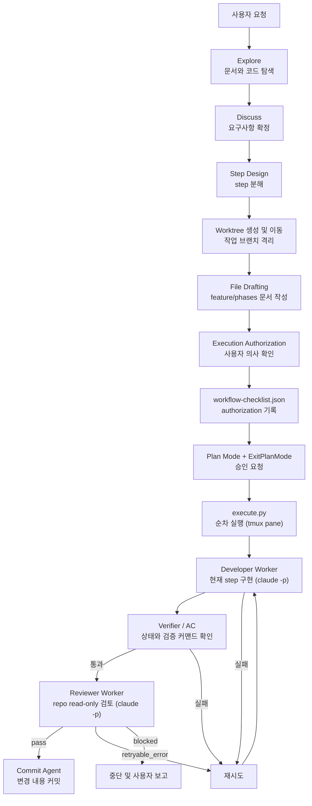

# harness 요약

`harness`는 개발을 바로 시작하기 전에 요청을 정리하고, 필요한 문서를 좁혀 읽고, step을 설계하고, 준비된 phase는 실행기까지 연결하는 하네스성 skill이다.

지금 이 Repo 기준으로 보면 `Explore → Discuss → Step Design → Worktree 생성 및 이동 → File Drafting → Execution Authorization → Execution` 흐름을 `workflow-checklist.json`으로 추적하고, 실행 단계에서는 `execute.py → developer worker → verifier/AC → reviewer → commit agent` 순서로 움직인다. 이 문서는 상세 사용법이 아니라, 나중에 다시 봤을 때 "아 지금 이런 구조였지"를 빠르게 떠올리기 위한 요약 문서다.

## 전체 흐름 요약



## Codex dev-start와의 차이

| 항목 | Codex | Claude Code |
|---|---|---|
| 실행 승인 | Codex Permission UI | Plan Mode + `ExitPlanMode` |
| worker 실행 | `codex exec --ephemeral` subprocess | `claude -p --dangerously-skip-permissions` + tmux pane |
| 마지막 메시지 | `-o output_file` 플래그 | stdout 리다이렉트 → output_file |
| 파일 쓰기 sandbox | `-s workspace-write` 기술적 강제 | hooks 방어선 + guardrails 프롬프트 |
| reviewer read-only | `-s read-only` 기술적 강제 | reviewer guardrails 프롬프트로 지시 |
| 가시성 | 없음 (capture_output) | tmux pane으로 worker 실행 상태 실시간 확인 |
| workflow 추적 | `workflow-checklist.json` | 동일 (`workflow-checklist.json` 유지) |

## 단계별 역할

### 1. Explore / Discuss

`CLAUDE.md`를 읽고 현재 Repo 규칙을 파악한다. 요구사항이 모호하면 구현 전에 사용자와 논의한다.

### 2. Step Design

작업을 `docs/features/<feature-name>/phases/<phase-name>/step{N}.md` 단위로 분해한다.

### 3. Worktree 생성 및 이동

Step Design 완료 후 작업 브랜치 worktree를 생성하고 이동한다.

```bash
cd "$(git rev-parse --git-common-dir)/.."
git worktree add worktrees/<type>-<feature-name> -b <type>/<feature-name> develop
cd worktrees/<type>-<feature-name>
```

`git worktree add`와 `cd` 이동이 모두 완료돼야 이 단계가 완료다.

### 4. File Drafting

worktree 안에서 feature 문서와 phase 구조를 작성한다. 작성 완료 후 반드시 멈추고 문서 경로를 보고한다.

### 5. Execution Authorization

`execute.py` 실행 전 사용자 승인을 Plan Mode + `ExitPlanMode`로 받는다. 승인 전에는 파일을 수정하지 않는다. `approved_at` 기록 시 `date '+%Y-%m-%dT%H:%M:%S+0900'`으로 실제 시각을 확인한다.

### 6. Execution (내부 파이프라인)

step 7인 Execution 안에서 아래 순서로 처리된다.

- **Developer Worker**: `execute.py`가 tmux pane을 생성하고 `claude -p`로 worker를 실행한다. Acceptance Criteria를 직접 실행해 검증한다.
- **Reviewer Worker**: developer 결과를 read-only 관점으로 검토한다. `pass`, `retryable_error`, `blocked` 중 하나를 반환한다.
- **Commit Agent**: reviewer pass 시 `git status`/`git diff`를 확인하고 commit-conventions.md를 읽어 커밋 단위와 메시지를 판단해 커밋한다.

## 현재 Repo의 역할별 구성

- Workflow policy: `.claude/skills/harness/SKILL.md`
- Phase file reference: `.claude/skills/harness/references/phase-files.md`
- Context Manager: `.claude/skills/harness/scripts/step_context.py`
- Developer Worker: `.claude/skills/harness/scripts/developer_guardrails.py`, `.claude/skills/harness/scripts/developer_worker.py`
- Verifier / AC 재검증: `.claude/skills/harness/scripts/step_verifier.py`, `.claude/skills/harness/scripts/acceptance_runner.py`
- Reviewer Worker: `.claude/skills/harness/scripts/reviewer_guardrails.py`, `.claude/skills/harness/scripts/reviewer_worker.py`
- Commit Agent: `.claude/skills/harness/scripts/commit_agent.py`
- Orchestration: `.claude/skills/harness/scripts/execute.py`
