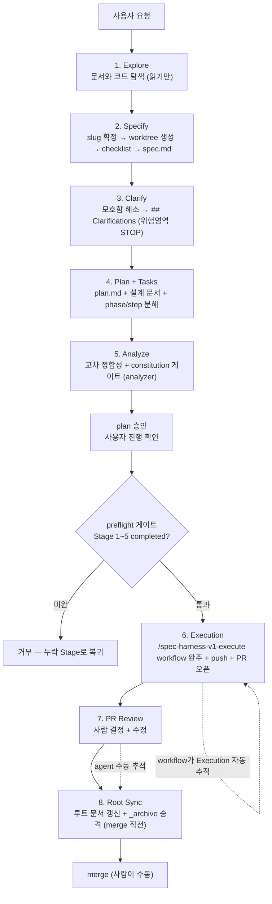
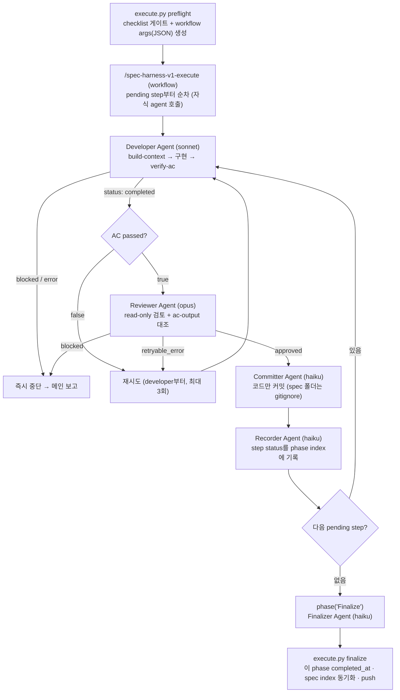
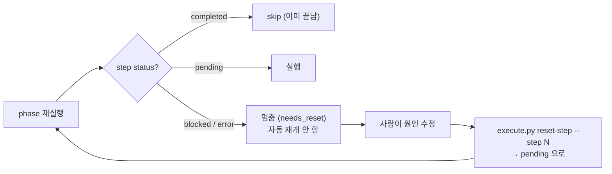

# spec-harness-v1 요약

`spec-harness-v1`은 개발을 바로 시작하기 전에 요청을 정리하고, 필요한 문서를 좁혀 읽고, step을 설계하고,
준비된 phase는 dynamic workflow로 자동 완주시키는 하네스성 skill이다.

`Explore → Specify → Clarify → Plan + Tasks → Analyze → Execution → PR Review → Root Sync` 8-Stage 흐름을
spec 레벨 `workflow-checklist.json`(spec 폴더 바로 아래) 하나로 추적한다. checklist는 **Specify(2)에서 worktree를
만들 때** `_template`에서 복사해 생성한다(worktree 생성·이동이 Specify에 흡수됐다 — 별도 Stage가 아니다).
각 단계가 자기 문서를 그 자리에서 쓴다(Specify→`spec.md`, Clarify→`## Clarifications`, Plan + Tasks→`plan.md`+설계 문서+phase/step).
명세 앞단(1~5)은 사람이 진행하며 갱신하고, 위험영역(결제·인증·데이터 모델·상태 전이)은 `docs/spec-constitution.md`에 따라 가정 없이 확정한다.
Stage 6(Execution)은 **메인이 자동 흐름으로** 처리한다 — 진입 시 `execute.py set-stage … in_progress`, 모든
phase의 preflight·workflow를 돈 뒤 `set-stage … completed`를 자동 호출한다(`preflight`가 실행 전 게이트로
검사하고, phase 단위인 preflight·finalize는 spec 레벨 Stage를 건드리지 않는다). Stage 7·8은 리뷰 결과·승격 완료를
사람이 확인한 시점에 `set-stage`로 갱신한다.
Stage 8(Root Sync)이 마지막이며, 이후 merge는 사람이 수동으로 한다(agent는 merge하지 않는다).

이 문서는 상세 사용법이 아니라, 나중에 다시 봤을 때 "아 이런 구조였지"를 빠르게 떠올리기 위한 요약이다.
상세 사용법은 `.claude/skills/spec-harness-v1/SKILL.md`, 파일·데이터 계약은 `references/phase-files.md`를 본다.

## 핵심 한 가지 — JS는 shell/git/fs를 직접 못 만진다

spec-harness-v1의 오케스트레이터는 **dynamic workflow(JavaScript)**다. 이 JS는 순수 JS라 shell·git·파일시스템을
직접 다루지 못하고, 오직 `agent()`로 서브에이전트를 띄우고 그 반환값으로 분기할 뿐이다. 그래서 AC 실행·git
커밋·정본 기록·finalize는 전부 **agent가 `execute.py` 서브커맨드를 통해** 대신 수행한다. 이 한 줄이 아래
구조 대부분을 설명한다.

## 용어

- **Stage**: harness workflow 전체의 진행 단계(1~8). `workflow-checklist.json`의 각 항목.
- **spec**: 최상위 작업 단위. 하나의 `spec.md`가 정점이고 `docs/specs/<spec-name>/` 폴더 하나가 한 spec.
- **step**: phase 내부의 구현 작업 단위. 커밋 1개에 대응하며, Stage 6(Execution)에서 workflow가 실행한다.
- **phase**: step들의 묶음이자 통합 사이클 단위. 기본은 spec당 1개이고, 강한 선후 의존이나 중간 검증
  가치가 있을 때만 여러 개로 나눈다.

## spec-kit과의 관계

이 harness는 GitHub spec-kit의 SDD(명세 주도 개발) 모델을 기반으로 하되, 단일 프로젝트·실행 검증·문서 정합에 맞춰 강화했다.

| 영역 | spec-kit | spec-harness-v1 |
| --- | --- | --- |
| 명세 앞단 (Specify~Analyze) | `/specify`·`/clarify`·`/plan`·`/analyze` | 거의 동일 + 위험영역 헌법·Constitution Check |
| 통과기준 | `tasks.md` 체크박스·서술 (테스트 OPTIONAL) | step `## AC` = 실행 명령 + exit code (verify-ac 필수) |
| 검증 주체 | 단일 에이전트 자기 점검 | 분리된 reviewer가 ac-output.json 대조 |
| 실패·수정 | halt, 자동 재시도 없음 | retryable→자동 재구현 / blocked→사람, spec 자동수정 금지 |
| 마무리 | (명시적 단계 없음) | PR Review·Root Sync·`_archive` 승격 |
| constitution | semver 버전 관리 | 버전 없음(git이 이력) + 위험영역 불가침 |

핵심: 명세 앞단은 spec-kit과 동급이고, **검증·수정 영역은 harness가 더 엄격하다** — 통과기준이 "말"이 아니라 "실행 명령"이고(verify-ac), 구현자와 검증자가 분리돼 있으며(reviewer), spec 자동 수정을 게이트로 차단한다(코드만 AC에 수렴). spec-kit이 서술로 짚는 기능 단위 통합 검증("Independent Test")만 harness엔 명시적으로 없으나, step을 기능 단위로 잡아 상당 부분 대체된다.

## 전체 흐름 (8-Stage)

Stage 6(Execution)에서 PR을 한 번만 오픈하고, Stage 7은 같은 브랜치/같은 PR에 커밋·push를 더 쌓는다.

> **실행 전 게이트**: `execute.py preflight`가 `workflow-checklist.json`을 검사해, **Execution(6) 직전 단계(1~5)가 모두
> completed가 아니면 거부**한다(workflow가 기동되지 않음). 탐색·스펙 정의·정합성 검사 없이 바로 구현에 돌입하는 것을
> 기계적으로 막는 장치다.

## Execution 내부 파이프라인 (Stage 6)

한 step의 한 시도(attempt)는 **developer → AC확인 → reviewer → committer → recorder** 전체다. 재시도하는
경우(AC 실패 / reviewer retryable / 파싱 실패)는 모두 developer부터 다시 돌고, 즉시 중단하는 경우(developer
blocked·error / reviewer blocked)는 그 step에서 멈춰 메인에 보고한다. 재시도는 **step당 최대 3회**까지다
(`MAX_RETRIES = 3`, `spec-harness-v1-execute.js`에 하드코딩). 3회 안에 `completed`로 끝나지 않으면 그 step에서
멈추고 사람에게 보고한다.

재시도 시 `stepN-ac-output.json`은 덮어쓰지 않고 `attempts[]`에 누적되어, reviewer의 자기보고 대조와 사후
분석의 자료가 된다. (developer 작업 결과는 별도 output.json으로 남기지 않는다 — 반환값·git·log·index가
대신하므로 읽는 주체가 없다.)

## 재개 정책 (pending-only)

phase를 재실행하면 workflow는 **`pending`인 step만 실행**한다.

`blocked`/`error`로 멈춘 step은 **자동 재개하지 않는다.** 원인을 안 고친 채 재실행하면 같은 실패를 반복하며
토큰만 낭비하기 때문이다. 사람이 원인을 고친 뒤 `execute.py reset-step`으로 그 step을 `pending`으로 되돌려야
재실행 시 재개된다(이때 agent를 한 개도 부르지 않고 즉시 멈추므로 낭비가 0이다). 이 재개의 영속성을 위해
step status는 매 step recorder가 디스크 정본(index.json)에 기록한다.

## 단계별 역할

### 1. Explore

`CLAUDE.md`와 현재 Repo 규칙을 파악한다. 현재 위치에서 기존 자산(외부 명세·루트 문서·관련 코드)을
**읽기만** 한다 — worktree·checklist·문서 생성은 Specify(2)에서 한다. 부족한 공통 맥락이 있을 때만
루트 `docs/`를 추가로 읽는다. 산출 없음.

### 2. Specify (slug 확정 → worktree 생성·이동 → checklist → spec.md 초안)

작업의 *무엇을·왜*를 확정하고 `docs/specs/<spec-name>/spec.md`를 쓴다. 요구사항이 모호하면 작성 전에
사용자와 논의한다. 작성 전 루트 문서(ADR·architecture·db-schema·api-spec)와의
정합성을 agent가 먼저 확인한다. 확정이 어려운 지점은 `[NEEDS CLARIFICATION]` 마커로 남긴다. `spec.md`는
*이 spec만의 작업용 스펙*이지 제품 전체 명세가 아니다.

### 3. Clarify

`spec.md`의 `[NEEDS CLARIFICATION]`를 해소하고 `## Clarifications`(날짜+근거)에 누적 기록한다. 위험영역
(결제·인증·데이터 모델·상태 전이) 공백은 가정 없이 사용자에게 묻는 게이트를 둔다. (포맷 상세는 작업 C에서 확정.
스크립트가 아니라 LLM 프롬프트로 동작.)

### 4. Plan + Tasks (옛 Step Design + 설계 문서)

`architecture.md`·`api-spec.md`·`db-schema.md`(해당 변경이 있을 때만)와 phase·step 구조를 만든다. 작업을
`docs/specs/<spec-name>/phases/<phase-name>/step{N}.md` 단위로 분해한다. phase는 통합 사이클 단위로, 기본
1개이며 선후 의존/중간 검증 가치가 있을 때만 나눈다. step의 `## Acceptance Criteria`가 "스펙에서 벗어남"의 정의선이다.

### 5. Analyze (analyzer 에이전트, 메인이 Task로 호출)

구현 전, 문서 교차 정합성(spec↔plan↔architecture↔data-model↔db-schema↔api-spec↔step)과 constitution 위반을
읽기 전용으로 점검하는 게이트. context 오염 방지를 위해 메인이 `spec-harness-v1-analyzer` 에이전트를 `Task`로 띄워
돌린다(워크플로 바깥이라 메인이 직접 호출). 6개 검출 패스(헌법 정합·커버리지 공백·미명세·모호·중복·불일치)로
마크다운 리포트를 내고, 헌법 위반은 자동 CRITICAL. 통과 후 작성 문서 경로를 보고하고 멈춰 검토·실행 승인을
기다린다("진행해"≠승인). 에이전트는 파일을 수정하지 않으며 로그도 남기지 않는다(리포트가 곧 산출물).

### 6. Execution (메인이 도는 자동 흐름: in_progress → phase 루프 → completed)

진입 시 `AskUserQuestion`으로 agent별 모델(developer/reviewer/commit)을 수집해 phase index `execution`에 기록한다
(기본 sonnet/opus/haiku). checklist는 **spec 레벨 하나**이고 그 안에서 **phase는 여러 개일 수 있다**. 메인은 Stage 6
진입과 동시에 아래 0~2를 **하나의 자동 흐름으로** 수행한다(사람이 단계마다 in_progress·completed를 지시하지 않는다):

0. **Execution을 in_progress로** (자동, 진입 시 1회): `execute.py set-stage <spec> Execution in_progress`.
1. **각 phase마다** preflight → workflow를 반복한다(자동).
   - **preflight**: `execute.py preflight <phase>` — checklist 게이트를 통과하면 phase index를 읽어 workflow 인자(JSON)를 만들고 active-phase 마커를 남긴다. (checklist Stage는 건드리지 않는다.)
   - **workflow 기동**: `/spec-harness-v1-execute with args <preflight 출력 JSON>` — workflow가 그 phase의 step을 완주시키고 finalizer로 phase를 닫는다.
2. **모든 phase 완료 후 Execution을 completed로** (자동, 전 phase 완료 시 1회): `execute.py set-stage <spec> Execution completed` → Stage 7로.

각 agent 역할:
- **Developer (sonnet)**: `build-context`로 컨텍스트를 로드하고 구현한 뒤 `verify-ac`로 AC를 검증한다.
  결과 status(`completed`/`blocked`/`error`)와 AC 결과를 JSON으로 반환한다.
- **Reviewer (opus)**: 변경을 read-only로 검토하고, `stepN-ac-output.json`을 읽어 developer의 AC 자기보고가
  정본과 일치하는지 대조한다. `approved`/`retryable_error`/`blocked`를 반환한다.
- **Committer (haiku)**: reviewer 승인 시 `commit-conventions.md`에 따라 **코드 변경만** 목적별로 커밋한다.
  spec 폴더는 `.gitignore`라 잡히지 않으므로 코드만 다룬다. body 없이 subject만.
- **Recorder (haiku)**: `record-step`으로 그 step의 status를 phase index에 기록한다.
- **Finalizer (haiku)**: 그 phase의 모든 step 완료 시 `finalize`로 **그 phase 하나를 닫는다** — `completed_at`,
  spec index의 이 phase status 동기화(워킹트리), 원격 push(committer가 만든 코드 커밋을 올림. 기본 동작,
  `execution.push=false`면 생략). checklist의 Stage는 건드리지 않는다(Execution(6)은 메인의 자동 흐름이 set-stage로 찍는다).

push 이후 PR 오픈(`gh pr create`)은 workflow 바깥에서 agent가 수행한다 — workflow는 구현·검증·커밋·push까지만 책임진다.

### 7. PR Review

Stage 6(Execution)에서 오픈한 PR의 review 코멘트를 처리한다. 사람이 항목별 처리 방향(accept / reject / modify)을
결정하고, 코드 수정·답변·resolve를 같은 브랜치/PR에 커밋·push로 쌓는다.

### 8. Root Sync

PR review까지 코드가 확정된 시점에 루트 문서를 현재 상태로 갱신한다(merge 직전, 멱등 재실행 가능).

- **ADR**: append. spec ADR에서 새로 채택된 결정만 루트 전역 번호로 이어붙인다. 대체 시 `supersedes` 표시.
- **architecture / db-schema / api-spec**: 루트 현재 파일 기준으로 이번 변경분만 반영해 갱신. 안 바뀐 부분 보존.
- **`_archive` 승격**: 루트 동기화와 별개로, spec 정본(`spec.md`·설계 문서·`step<N>.md`)을 `docs/specs/_archive/pr-<번호>-<spec명>/`로 복사해 같은 PR에 커밋한다(`docs/specs/*`는 gitignore지만 `_archive`는 예외). 진행 상태·실행 부산물(`index.json`·`checklist`·`ac-output`·`logs`)은 휘발로 남기고 승격하지 않는다. 이것이 "왜 이 spec을 했나"의 영구 기록이다.

Stage 8(Root Sync)이 spec-harness-v1의 마지막 단계다. 이후 merge는 사람이 수동으로 하며, agent는 merge하지 않는다. 작업 회고·지식 축적이 필요하면 harness 바깥에서 별도로 처리한다.

## 상태·산출 파일

**`docs/specs/<spec>/` 아래는 전부 `.gitignore`** — spec 문서·phase·step·index·checklist·ac-output·logs 모두
워킹트리 휘발이며 커밋하지 않는다. git에 남는 것은 spec 폴더 바깥의 **코드**(committer가 커밋)와, Stage 8에서
루트로 승격된 문서뿐이다. 그래서 아래 표에는 "커밋 여부" 칸을 두지 않는다.

| 파일 | 누가 쓰나 | 누가 읽나 |
|---|---|---|
| `phases/<phase>/index.json` | recorder(step status)·finalizer(completed_at) | preflight·재실행 skip 판단 |
| `phases/index.json` (spec 레벨) | finalizer(phase status 동기화) | 전 phase 완료 판단 |
| `workflow-checklist.json` (spec 레벨, spec 루트) | Stage 1~5 작성·`set-stage`(6~8) | **preflight 게이트** |
| `stepN-ac-output.json` | verify-ac(attempt마다 append) | **reviewer**(자기보고 대조) |
| `logs/<role>.log` | 로깅 hook | 사람(사후 분석·디버깅) |
| 코드 (spec 폴더 바깥) | developer | reviewer → committer가 커밋 |

- **output.json은 만들지 않는다.** 결과를 agent 반환값으로 받고 검증은 ac-output·git·log·index가 대신하므로
  읽는 주체가 없다(dead artifact 회피).
- 타임스탬프는 KST(+09:00).

## 안전장치 (권한 정책)

spec-harness-v1은 권한 hook을 따로 두지 않는다. 두 축으로 나뉜다.

- **agent별 역할 제한** = 각 agent `.md`의 `tools`/`disallowedTools`가 담당한다.
  - committer → `Bash(git *)`, Read만
  - reviewer → Read·Grep·Glob + read-only git, `disallowedTools: Edit, Write`
  - recorder → `Bash(python3 *)`만
  - finalizer → `Bash(python3 *)`, `Bash(git *)`
  - developer → 구현 agent라 Read/Edit/Write/Bash/Grep/Glob (넓음)
- **보호 브랜치 차단** = repo 정본 `.claude/hooks/pre_tool_use_policy.py`가 담당한다. spec-harness-v1은
  이 hook을 **건드리지 않는다.** `main`/`develop` 직접 push·commit만 막고, 피처 브랜치(worktree) 안에서는
  제약하지 않는다(격리 + PR 리뷰로 충분).

## 현재 Repo의 역할별 구성

- Workflow policy: `.claude/skills/spec-harness-v1/SKILL.md`
- Phase file reference: `.claude/skills/spec-harness-v1/references/phase-files.md`
- Orchestrator (workflow): `.claude/workflows/spec-harness-v1-execute.js` (저장 명령 `/spec-harness-v1-execute`)
- Agents (Stage 6 실행, 워크플로가 호출): `.claude/agents/spec-harness-v1-{developer,reviewer,committer,recorder,finalizer}.md`
- Agent (Stage 5 Analyze, 메인이 Task로 호출): `.claude/agents/spec-harness-v1-analyzer.md` — read-only, 로깅 hook 비대상
- 서브커맨드/검증/git/컨텍스트: `.claude/skills/spec-harness-v1/scripts/{execute,acceptance_check,git_ops,step_context}.py`
- 로깅: `.claude/skills/spec-harness-v1/scripts/{transcript_formatter,format_events}.py`, `scripts/hooks/{log_progress,log_stop}.sh`
- 역할 제한: 각 agent `.md`의 `tools`/`disallowedTools`
- 보호 브랜치 hook: repo 정본 `.claude/hooks/pre_tool_use_policy.py` (spec-harness-v1이 건드리지 않음)
- Hook 등록: 정본 `.claude/settings.json`에 로깅 hook(SubagentStop·PostToolUse) 병합
