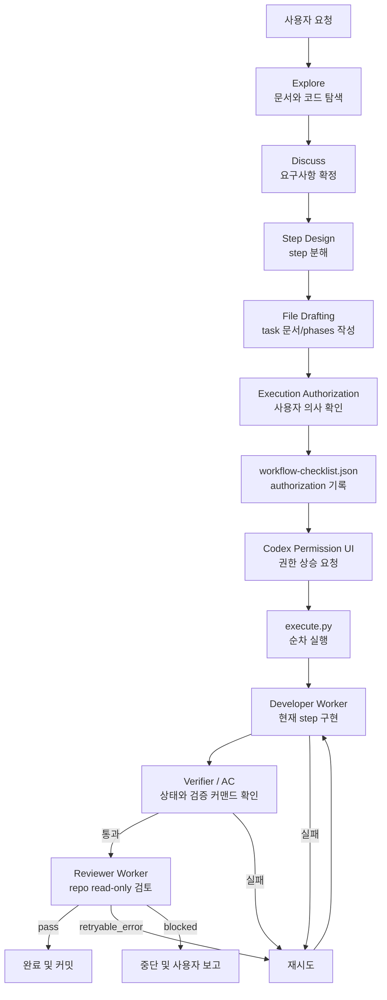

# dev-start 요약

`dev-start`는 개발을 바로 시작하기 전에 요청을 정리하고, 필요한 문서를 좁혀 읽고, step을 설계하고, 준비된 phase는 실행기까지 연결하는 하네스성 skill이다.

지금 이 Repo 기준으로 보면 `Explore -> Discuss -> Step Design -> File Drafting -> Execution Authorization -> Permission UI -> Execution` 흐름을 `workflow-checklist.json`으로 추적하고, 실행 단계에서는 `execute.py -> developer -> verifier/AC -> reviewer -> commit` 순서로 움직인다. 이 문서는 상세 사용법이 아니라, 나중에 다시 봤을 때 "아 지금 이런 구조였지"를 빠르게 떠올리기 위한 요약 문서다.

## 전체 흐름 요약

## 단계별 역할

### 1. Explore / Discuss

구현 전에 repo 규칙, task 문서, phase 문서, 관련 코드와 테스트를 좁혀 읽는다.

- 요구사항이 모호하면 바로 구현하지 않고 사용자와 논의한다.
- 이미 문서나 코드에서 답할 수 있는 질문은 사용자에게 다시 묻지 않는다.
- 공통 문서는 task 문서만으로 부족할 때만 추가로 읽는다.

### 2. Step Design

작업을 `docs/tasks/<task-name>/phases/<phase-name>/step{N}.md` 단위로 쪼갠다.

- 한 step은 테스트 가능한 사용자 기능 단위를 기본값으로 삼는다.
- 같은 기능 완성에 필요한 domain, repository, service, controller, test는 한 step에 함께 포함할 수 있다.
- 레이어별 step은 공통 도메인 선행 작업이나 독립 DB 마이그레이션처럼 분리 검증이 명확한 경우에만 사용한다.
- root docs sync는 구현과 전체 테스트가 끝난 뒤 마지막 step에서 한 번 수행한다.
- 모든 step의 `수정 가능 경로`에는 `docs/tasks/<task-name>/**`를 포함한다.
- 커밋 단위는 파일 단위가 아니라 명확한 기능/정책 목적 단위로 나누고, 메시지는 `docs/commit-conventions.md`를 따른다.
- Acceptance Criteria는 실행 가능한 커맨드로 작성한다.

### 3. File Drafting

사용자가 파일 생성을 승인하면 task 문서와 phase 문서를 작성한다.

- `workflow-checklist.json`은 phase마다 반드시 만든다.
- 초안 작성 직후 checklist는 1~4번만 `completed`, 5~6번은 `pending`이어야 한다.
- File Drafting 완료 후에는 문서 경로를 보고하고 멈춘다. 바로 실행 승인 단계로 넘어가지 않는다.

### 4. Execution Authorization

`execute.py` 실행 전에 사용자에게 두 가지를 명확히 확인한다.

- 권한 상승 실행 허락: `execute.py`를 권한 상승으로 실행해도 되는지.
- 승인 프롬프트 처리 방식: 매번 승인할지, `prefix_rule=["python3", ".codex/skills/dev-start/scripts/execute.py"]`로 저장할지.

두 입력이 모두 확정되면 agent가 checklist의 `Execution Authorization`을 `completed`로 바꾸고 `authorization` 객체에 결과를 기록한다. 그 다음 Codex permission UI에서 실제 권한 상승 요청을 보낸다.

### 5. Developer Worker

실제 구현을 수행하는 역할이다.

- 현재 step만 구현한다.
- 수정 가능 경로 밖으로 나가지 않는다.
- Acceptance Criteria를 직접 실행해 본다.
- step 상태를 `completed`, `error`, `blocked` 중 하나로 갱신하고 필요한 필드를 남긴다.
- phase index는 step 진행 상태로 사용하고 phase 종료 시 커밋한다. output, AC output, review output, workflow checklist는 로컬 실행 산출물이며 커밋하지 않는다.
- 실패 회피 목적으로 step 요구사항, Acceptance Criteria, task 문서, root docs, `수정 가능 경로`를 임의 수정하지 않는다.

현재 구현상 이 역할은 `developer_guardrails` + `developer_worker` 조합으로 동작한다.

### 6. Verifier / AC 재검증

developer가 `completed`라고 썼다고 바로 끝나지 않는다. 실행기가 결과를 다시 검증한다.

- `step_verifier`가 상태와 output 형식을 먼저 확인한다.
- `completed`면 실행기가 Acceptance Criteria를 직접 다시 실행한다.
- AC 결과는 `stepN-ac-output.json`으로 기록된다.
- verifier, AC 재검증 중 하나라도 실패하면 다음 시도로 되돌린다.

즉 완료 판정 기준은 "모델이 그렇게 말했다"가 아니라 "실행기 검증을 통과했다"에 가깝다.

### 7. Reviewer Worker

developer가 만든 결과를 read-only 관점에서 한 번 더 본다.

- 변경 경로, output, AC 결과를 바탕으로 실제 repo 파일을 read-only로 확인한다.
- correctness, regression, test 누락, 명백한 규칙 위반을 중심으로 판단한다.
- `pass`, `retryable_error`, `blocked` 중 하나를 반환한다.

현재 구현상 이 역할은 `reviewer_guardrails` + `reviewer_worker` 조합으로 동작한다.

### 8. 완료 / 재시도 / 차단

하네스는 한 번 실행하고 끝나는 구조가 아니라, 실패 사유를 다음 시도 컨텍스트에 넣어 다시 돌리는 루프에 가깝다.

- verifier 실패 -> 재시도
- AC 재검증 실패 -> 재시도
- reviewer `retryable_error` -> 재시도
- reviewer `blocked` -> 즉시 차단 종료
- 모두 통과한 경우에만 완료와 기능 변경 커밋으로 간다
- `blocked` 또는 최종 `error`는 자동 복구하지 않고 사용자에게 실패 step, 실패 사유, output 파일을 보고한다.
- 실행 중 재시도 reset은 `execute.py` 내부 동작이고, 최종 실패 후 상태 복구는 사용자 승인 후에만 한다.

## 현재 Repo의 역할별 구성

- Workflow policy: `.codex/skills/dev-start/SKILL.md`
- Phase file reference: `.codex/skills/dev-start/references/phase-files.md`
- Context Manager: `.codex/skills/dev-start/scripts/step_context.py`
- Developer Worker: `.codex/skills/dev-start/scripts/developer_guardrails.py`, `.codex/skills/dev-start/scripts/developer_worker.py`
- Verifier / AC 재검증: `.codex/skills/dev-start/scripts/step_verifier.py`, `.codex/skills/dev-start/scripts/acceptance_runner.py`
- Reviewer Worker: `.codex/skills/dev-start/scripts/reviewer_guardrails.py`, `.codex/skills/dev-start/scripts/reviewer_worker.py`
- Orchestration: `.codex/skills/dev-start/scripts/execute.py`
