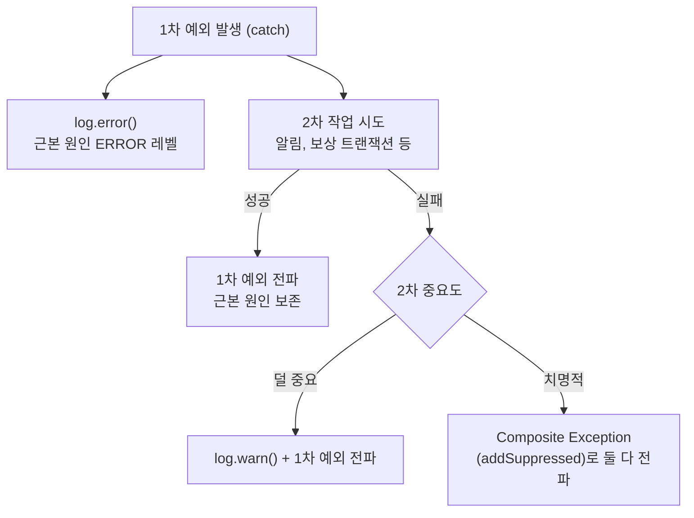

# 예외 처리 정책

## 핵심 원칙 (요약)

> 코딩 시 반드시 지킬 보편 원칙이다. 도메인별 사례·상세는 아래 본문이 단일 출처다.

- **예외 노출 경계는 예외의 추상 수준으로 긋는다**: application·domain·presentation은 특정 구현체(JPA·Hibernate)에 묶인 구체 예외(`org.springframework.orm.*`, `org.hibernate.*`, `jakarta.persistence` 예외)를 참조하지 않는다. 반면 특정 영속성 구현에 묶이지 않은 Spring DAO 추상 예외(`org.springframework.dao.*`, 예: `OptimisticLockingFailureException`·`DataIntegrityViolationException`)는 application이 다뤄도 된다 — Spring은 교체 대상이 아니고 이 계층은 JDBC/JPA/MyBatis를 가리지 않는 추상이기 때문이다. 추상 상위 타입을 잡으면 그 하위 구현체 타입이 다형적으로 걸리므로, 상위 계층이 구현체 타입 이름을 부를 일이 없다. **domain은 추상·구체 어느 영속성 예외도 모른다.**
- **번역은 의무가 아니라 선별적이다**: 기술 예외 → 도메인 예외 번역은 **안쪽이 그 예외에 따라 다르게 처리해야 할 때만** `infrastructure/persistence/` adapter가 한다(유니크 위반 → 이미 존재/이중결제 차단 등). 순수 재시도처럼 그 예외를 따로 처리하지 않으면 번역하지 않고 DAO 추상 예외를 그대로 usecase가 잡거나 끝단 핸들러로 흘려보낸다. 판단축은 "안쪽이 그 예외를 실제로 다루는가"다.
- **find-first 패턴**: 정상 흐름은 사전 `find`로 처리(멱등/중복 흡수). DB 무결성 위반(unique race, NOT NULL/FK/CHECK)은 catch하지 말고 `GlobalExceptionHandler` 안전망(500)에 위임한다. (단 그 위반을 특정 상황으로 구분해 처리해야 하면 adapter에서 도메인 예외로 번역해 4xx로 다룰 수 있다.)
- **충돌이 잦은 시나리오**는 예외적으로 try-save-catch가 더 적합하다. 이때 DAO 추상 예외(`DuplicateKeyException` 등)를 잡는 건 허용되지만, 구현체에 묶인 구체 타입(`org.hibernate.*`·`org.springframework.orm.*`)은 직접 잡지 않는다 — 추상 상위를 잡으면 구체 하위가 다형적으로 걸린다.
- **낙관 락(@Version) 충돌**: tx 경계 밖에서 정책(전파/skip/retry)을 정한다. **순수 재시도**면 usecase가 DAO 추상 예외 `OptimisticLockingFailureException`을 직접 잡아 새 tx로 재시도한다(번역·`saveAndFlush` 불필요). **충돌에 따라 다르게 처리**해야 하면 `infrastructure/persistence/` adapter가 `saveAndFlush`로 감지를 당겨 도메인 예외로 번역한다. 상세·근거는 `docs/optimistic-lock-design.md`가 단일 출처. (unique 위반과 달리 충돌은 정상 시나리오라 409 — 아래 "왜 500 vs 409" 참고.)
- **보상 catch (catch 안 2차 작업)**: 1차 예외는 진입 즉시 `log.error()`(근본 원인 보존). 2차 성공 시 1차만 전파. 2차 실패·덜 중요하면 `log.warn()`+1차 전파. 2차 실패·치명적이면 `addSuppressed`로 둘 다 전파. **레벨: 1차=ERROR. 2차 실패는 덜 중요하면 WARN+1차 전파, 치명적이면 addSuppressed로 둘 다 전파.**
- **catch 안 메서드는 가급적 예외를 안 던지게 설계**하고 의도를 메서드명에 캡슐화한다. Composite Exception은 도저히 안 될 때만.
- **외부 캐시(Redis) 장애**: infra adapter가 `DataAccessException`을 잡아 도메인 예외(`*StoreUnavailableException`)로 변환(port에 DAO 예외 노출 금지). 정책 결정(fallback/응답 매핑)은 application/presentation이 한다. 도메인 예외는 `RuntimeException` 직접 상속.
- **PG 결과 불명(UNKNOWN)**: 전송 후/불명 예외는 UNKNOWN 보존, 전송 전 버그는 안전망 500. UNKNOWN 행 있는 주문은 `PAYMENT_RESULT_PENDING`(409)로 차단.

---

## DB 무결성 위반 흐름

무결성 위반은 정상 흐름을 사전 `find` 로 처리하고, 실제 발생하면 `GlobalExceptionHandler` 안전망에 위임한다. `insert` 시점의 unique race는 DAO 추상 예외 `DataIntegrityViolationException` 으로 안전망까지 흘려 500으로 가시화한다(아래 본질 흐름).

**안쪽이 그 위반에 따라 다르게 처리해야 하면 예외적으로 번역한다**: 특정 유니크 제약이 명확한 비즈니스 개념에 1:1 대응하고 안쪽이 그에 따라 처리를 달리하면, `infrastructure/persistence/` adapter가 제약을 식별해 도메인 예외로 번역한다. 이때도 adapter는 DAO 추상 상위(`DataIntegrityViolationException`)를 잡지, 구현체에 묶인 구체 타입(`org.hibernate.*`·`jakarta.persistence.*`)을 잡지 않는다. (commerce의 예: `PaymentRepositoryAdapter`가 `uk_payment_approved_order_key` 위반을 이중결제 신호로 식별 — 아래 "unique 위반 제약명 식별".)

### 본질 흐름 — find-first 패턴

```
DB find → 없으면 insert → 충돌 시 500
```

- 사전 `find` 가 정상 멱등/중복 시나리오를 흡수한다 (도메인 4xx 또는 정상 200 흐름).
- `insert` 시점의 unique 위반은 race window 한정이며, 안전망 500 으로 코드 버그처럼 가시화한다.
- NOT NULL / FK / CHECK 위반도 동일하게 안전망 500 으로 전파된다.

### 정책 적용 조건과 한계

본 정책은 다음 두 조건이 모두 만족될 때 유효하다.

1. **트랜잭션이 짧다** — race window 가 좁아 안전망 500 의 발생률이 무시 가능한 수준이다.
2. **정상 흐름에서 동시 충돌 확률이 낮다** — 사용자 입력 식별자(email, merchantPayKey) 나 idempotency key 기반 unique.

위 두 조건(짧은 트랜잭션 + 낮은 동시 충돌 확률)을 만족하는 서비스에 적용한다. 적용되는 서비스의 정확한 목록은 코드(`com.commerce.<domain>`)가 단일 출처이며, 본 문서는 하나하나 다 적지 않는다(클래스명이 바뀌면 문서가 안 맞게 되므로). 대표적으로 회원 가입·결제 승인/이력·주문 생성 등 사용자 입력 식별자나 idempotency key 기반 unique를 쓰는 경로가 해당한다.

**비적용 상황**: 충돌이 잦을 것으로 예상되는 시나리오(예: 캐시 미스 후 동시 다발 insert, 대규모 일괄 처리 race) 에는 본 정책을 적용하지 않고 **try-save-catch** 패턴이 더 적합하다. 향후 새 unique 제약을 도입할 때 위 두 조건으로 패턴을 선택하며, try-save-catch 를 선택하더라도 DAO 추상 예외(`DuplicateKeyException` 등)를 잡는 건 허용되지만 구현체에 묶인 구체 타입(`org.hibernate.*`·`org.springframework.orm.*`)은 직접 잡지 않는다 — 추상 상위를 잡으면 구체 하위가 다형적으로 걸린다.

### GlobalExceptionHandler 안전망 계층

```
DataAccessException (부모 핸들러, COMMON-500-2)
├─ DataIntegrityViolationException (COMMON-500-1)            ← unique / NOT NULL / FK / CHECK
└─ OptimisticLockingFailureException (COMMON-409-1)           ← 409 (낙관적 락 정상 시나리오)
```

- Spring `@ExceptionHandler` 는 가장 구체적인 타입을 먼저 매칭한다. 두 구체 핸들러(`DataIntegrityViolationException`, `OptimisticLockingFailureException`) 가 우선 매칭되고, 부모 `DataAccessException` 핸들러는 그 외 DAO 예외(`BadSqlGrammarException`, `CannotAcquireLockException`, `DataAccessResourceFailureException` 등) 만 받는다.
- unique 위반은 `DataIntegrityViolationException`(cause=Hibernate `ConstraintViolationException`) 으로 올라와 같은 핸들러에 흡수된다 (translator 빈 제거 후 형태, → PR#228).
- `DataIntegrityViolationException` 핸들러는 unique race window 와 NOT NULL/FK/CHECK 위반을 모두 잡아 500 + stack trace 로그(`COMMON-500-1`) 를 남긴다.
- `DataAccessException` 부모 핸들러는 DAO 카테고리 fallback 으로 500 + stack trace + `COMMON-500-2` 를 남겨 운영 모니터링에서 일반 `Exception` fallback 과 구분 가능하게 한다.
- `OptimisticLockingFailureException` 핸들러는 낙관적 락 충돌(정상 시나리오) 을 409 로 유지한다.

> **왜 unique 위반은 500인데 낙관 락 충돌은 409인가** — 둘 다 동시성 충돌이지만 의미가 반대다.
> unique race는 find-first를 제대로 썼다면 정상 흐름에선 거의 안 나야 하는 것이라, 나면 코드 버그처럼
> 가시화(500)한다. 낙관 락 충돌은 같은 행을 동시 전이할 때 *정상적으로 발생할 수 있는* 것이라 재시도/대기를
> 유도하는 409로 둔다. 즉 "안 나야 정상 → 500", "날 수 있는 정상 → 409".

### unique 위반 제약명 식별 (→ PR#228)

`JpaConfig` 의 `SQLErrorCodeSQLExceptionTranslator` 빈은 제거됐다. 이 빈은 `db-constraint-violation-handling` 에서 application 의 `DuplicateKeyException` catch 를 위해 등록됐으나 그 catch 는 find-first 전환(→ PR#109)으로 폐기됐고, 남은 정당화("운영 로그에서 `DuplicateKeyException` 타입 구분")는 무가치했다 — 빈 유무와 무관하게 unique 위반은 같은 핸들러·같은 `COMMON-500-1` 로 분류되고 `Duplicate entry ... for key ...` `SQLException` 메시지가 cause 체인에 남는다.

빈 제거 후 unique 위반은 `DataIntegrityViolationException`(cause=Hibernate `ConstraintViolationException`(cause=`SQLException`)) 으로 올라온다. 제약명이 필요한 곳(`PaymentRepositoryAdapter.isApprovedOrderKeyViolation`, 이중결제 식별) 은 Hibernate `ConstraintViolationException.getConstraintName()` 을 사용한다. MySQL 환경에서 이 값은 테이블 prefix 를 포함하므로(`tbl_payment.uk_payment_approved_order_key`) 전체 제약명을 대소문자 무시(`equalsIgnoreCase`)로 비교한다. 제약명을 소비하는 adapter 는 이미 JPA 전용이라 Hibernate API 의존이 자연스럽다.

---

## 낙관 락(@Version) 충돌 흐름

`@Version` 기반 낙관 락 충돌(`OptimisticLockingFailureException` / `ObjectOptimisticLockingFailureException`)의 처리 정책이다. unique 위반(위)과 달리 충돌은 *정상적으로 발생할 수 있는* 시나리오이므로 다르게 다룬다. **상세·근거·코드 스케치는 `docs/optimistic-lock-design.md`가 단일 출처**이며, 본 절은 예외 처리 관점의 규칙만 요약한다.

### 핵심 규칙

- **tx 경계 안에서는 충돌을 catch하지 않는다.** 변환된 도메인 예외를 전파시켜 트랜잭션을 깨끗이 rollback한다. 경계 안에서 catch하면 `REQUIRES_NEW`라도 커밋 시 `UnexpectedRollbackException`이 난다(충돌 후 tx는 rollback-only).
- **skip / retry / 전파 결정(정책)은 tx 경계 밖에서** 한다. 같은 tx 단위작업을 호출 맥락에 따라 전파(→409)·skip(보상)·retry(고경합)로 재사용한다.
- **번역은 선별적이다.** 순수 재시도면 usecase가 tx 경계 밖에서 DAO 추상 예외 `OptimisticLockingFailureException`을 직접 잡아 새 tx로 재시도한다 — 번역도 `saveAndFlush`도 필요 없다(커밋 시점 예외가 tx 경계 밖으로 그대로 전파되므로 usecase에서 잡힌다). 반대로 충돌에 따라 *다르게 처리*해야 하면, adapter가 `saveAndFlush`로 감지를 커밋 전으로 당겨 `infrastructure/persistence/`에서 도메인 예외로 번역한다(그래야 예외가 adapter 메서드 안에서 터져 잡을 수 있다). 즉 `saveAndFlush`는 **번역이 필요할 때만** 쓴다.

### 충돌 도메인 예외의 상속 전략 — Redis 장애와 반대다

같은 "도메인 예외"라도 **자동 응답 매핑을 원하느냐**에 따라 상속 전략이 갈린다. 이 대비를 혼동하면 안 된다.

| | 상속 | 이유 |
|---|---|---|
| 충돌(`PAYMENT_CONCURRENTLY_MODIFIED` 등) | `CustomException` 류 | GlobalExceptionHandler가 **409로 자동 매핑되길 원함**(전파 정책) |
| Redis 장애(`*StoreUnavailableException`) | `RuntimeException` 직접 | 자동 매핑을 **회피**해야 함(application catch / 도메인별 매핑 의도 보존) |

→ "도메인 예외는 RuntimeException 직접 상속"은 Redis 장애 한정 규칙이지 일반 규칙이 아니다. 충돌 예외는 정반대로 자동 매핑을 활용한다.

### 의미 코드 vs 일반 코드

충돌을 도메인 예외로 변환할 때, 그 경로에서 충돌이 단일 비즈니스 의미로 1:1 대응하면 의미 코드(예: reservation use의 `PAYMENT_RESERVATION_ALREADY_USED`)로 번역하고, 그렇지 않으면 일반 충돌 코드(`PAYMENT_CONCURRENTLY_MODIFIED`)로 두고 필요 시 재조회로 상태를 판정한다. 의미 코드는 그 행의 동시 쓰기 경로가 하나뿐일 때만 정직하다(경로가 늘면 거짓 양성). 상세는 design 문서 5장.

### 기계 검증

다음 규칙은 ArchUnit 테스트(`ArchitectureRulesTest`)로 강제한다. 문서는 "왜"의 포인터, 테스트는 "무엇이 강제되나"의 단일 출처다.

- **구현체에 묶인 구체 예외**(`org.springframework.orm.*`, `org.hibernate.*`, `jakarta.persistence` 예외)는 **application·domain·presentation에 노출 금지**. 추상 상위(`org.springframework.dao.*`)를 잡으면 하위 구현체 타입이 다형적으로 걸리므로 상위 계층이 구현체 타입 이름을 쓸 일이 없다.
- **domain은 `org.springframework.dao.*` 추상 예외도 참조 금지**(가장 안쪽, 순수). application은 DAO 추상 예외를 허용.
- `saveAndFlush`는 `infrastructure.persistence`에서만 호출.
- presentation Controller는 낙관 락 충돌 예외를 catch하지 않는다(전파 → application 재시도 또는 끝단 409 매핑).

---

## Redis 캐시 장애 처리

외부 캐시(Redis) 장애는 fallback 가능 여부와 무관하게 *infra adapter의 도메인 예외 매핑 + application/presentation의 정책 결정* 으로 처리한다. 캐시는 커스텀 아웃바운드 port(`application/port/`)이고 그 계약이 Spring·영속성 예외 타입을 노출하면 안 되므로 adapter가 도메인 예외로 변환한다 — 낙관 락과 달리 실패가 adapter 메서드 안에서 동기적으로 잡히므로 그 자리에서 변환할 수 있다.

### 본질 흐름

```
Infra adapter: DataAccessException catch → *StoreUnavailableException 도메인 예외 변환 (log.error)
Application/Presentation: 도메인 예외를 받아 정책 결정 (fallback 진입 또는 응답 매핑)
```

- Infra 는 *기술적 사실* (어떤 예외인지) 만 알면 되고, *어떻게 대응할지* 는 application/presentation 의 정책.
- port 시그니처에 Spring `DataAccessException` 이 노출되지 않아 port 추상화가 보존된다.
- 도메인 예외는 `RuntimeException` 직접 상속 (`CustomException` 상속 시 `GlobalExceptionHandler.handleCustomException` 가 자동 응답 매핑되어 *책임 분리* 또는 *application catch 의도* 가 우회됨).
- 적용처:
  - `OrderIdempotencyStore` ↔ `OrderCreateService` (`order-idempotency-cache-simplification`, application catch + fallback).
  - `RefreshTokenStore` ↔ `RedisRefreshTokenStore` ↔ `AuthExceptionHandler` (`auth-refresh-token-store-unavailable`, presentation 위임 + 응답 매핑).

### catch 위치 분기 — application vs presentation

매핑 단계(infra adapter)는 어느 도메인이든 동일하다. 변환 이후 *정책 결정 위치* 는 fallback 가능 여부에 따라 두 갈래로 분기한다.

- **fallback 가능 (Order)** — application이 도메인 예외를 catch해 DB unique 안전망 경로로 fallback 진입. fallback 진입이라는 *정책 결정 사실* 이 있어 WARN 로그 가치도 있다.
- **fallback 불가 (Auth)** — application은 catch하지 않는다. 도메인 모듈의 `@RestControllerAdvice` (`AuthExceptionHandler`)가 도메인 예외를 받아 `AUTH-500-1` 500 응답으로 매핑. *단순 변환 보일러플레이트* 와 *중복 로그* 가 모두 사라진다.

패턴 선택의 분기점은 fallback 가능 여부가 아니라 *application 정책 결정 내용* 이다. 매핑 구조(infra adapter → 도메인 예외) 자체는 공통 규약이다.

**도메인-specific `@RestControllerAdvice`** 는 *도메인 모듈 안에* 둔다 (`common`이 도메인을 import하는 역의존 회피). 우선순위/범위 한정은 사용처가 늘어났을 때 재검토.

**베이스 클래스** (`StoreUnavailableException`) 추출은 Payment/Stock 등 3곳 이상 사용처가 등장하고 공통 catch 시나리오가 실제로 필요해진 시점에 별도 검토 (현재 YAGNI).

### 로깅 규약

- infra adapter (저장소 실패 자체): ERROR + stack — 운영자가 외부 시스템 장애를 즉시 인지.
- application (fallback 분기 결정): WARN + 메타데이터 — 정상 흐름의 fallback 진입 사실 기록.
- fallback 불가 케이스 (Auth): application과 presentation 모두 로그를 남기지 않는다. infra ERROR + stack으로 운영 인지가 보장되며, 정책 결정 사실 (`AUTH-500-1` 응답 매핑)은 운영 로그에서 별도 식별 가치가 없다.

---

## 보상 catch 2차 예외 처리

보상 트랜잭션·알림 발송처럼 catch 블록 안에서 2차 작업을 시도해야 할 때의 정책이다. 2차 시도가 또 예외를 던지면 1차 예외(근본 원인)가 가려지거나 보상 흐름 자체가 중단될 수 있다. 본 섹션은 그 경우의 일관된 처리 방식을 정의한다.

전체 로깅 규칙(레벨 기준, 마스킹, 포맷 등)은 `docs/logging-conventions.md`를 참고한다.

### 의사결정 트리



### 원칙

- 1차 예외는 catch 진입 즉시 `log.error()`로 ERROR 레벨에 남긴다.
- 2차 시도가 성공하면 1차 예외만 전파한다(근본 원인 보존).
- 2차 시도가 실패하고 덜 중요한 경우 `log.warn()`으로 기록하고 1차 예외만 전파한다.
- 2차 시도가 실패하고 치명적인 경우 Composite Exception(`addSuppressed`)으로 1차·2차를 둘 다 담아 전파한다.
- 로그 레벨 규약: **1차 = ERROR. 2차 실패는 덜 중요하면 WARN(+1차 전파), 치명적이면 addSuppressed로 둘 다 전파**(WARN으로 끝나지 않음).

### 설계 원칙

catch 안에서 호출하는 skip 로직은 가급적 예외를 던지지 않게 설계한다. "조건 안 맞으면 조용히 skip"이라는 의도를 캡슐화해 호출처가 try-catch 없이 평탄하게 보상을 진행하도록 한다. **이 skip 로직은 보통 그것을 쓰는 흐름 하나에만 의미가 있으므로, 별도 클래스가 아니라 그 흐름을 가진 Service 안의 private 메서드로 둔다**(여러 Service가 공유할 때만 추출). 자세한 배치 기준은 `docs/optimistic-lock-design.md`·`docs/package-structure-conventions.md` 참조. Composite Exception은 catch 안 로직을 도저히 예외 없이 설계할 수 없는 치명적 경우에만 사용한다.

### 적용 예

> 아래는 원칙이 적용된 *예시*다(완전한 목록 아님). 클래스·메서드명은 코드가 단일 출처이므로 예시가 낡아도 원칙 자체는 유지된다.

- **상위 catch는 진입 즉시 1차를 ERROR로 남긴다** — 예: `NaverPayApprovalUseCase.completeVerifiedApproval`의 상위 catch(`PaymentException`/`CustomException`/`Exception`)가 진입 직후 1차 예외를 `log.error`로 보존한다.
- **보상 catch 안 skip은 예외를 안 던지고 흐름을 멈추지 않는다** — 예: 보상 흐름에서 "현재 상태가 REQUESTED면 실패 처리, 아니면 skip"을 캡슐화해(현재는 `failIfRequested`, 향후 흐름 Service의 private 메서드로) 호출처가 try-catch 없이 평탄하게 진행한다. approve payment가 race window에서 이미 SUCCEEDED가 됐어도 PG cancel은 멈추지 않고 mark만 skip된다.
- **사실 조회와 정책 적용을 분리한다** — 예: "완료된 Payment row 존재 여부"라는 *사실*은 Payment 도메인 소유자에 박아 두고(`hasCompletedPayment`), 보상 service는 그 사실을 받아 *정책*(`if (hasCompletedPayment) skip`)만 적용한다. 이는 낙관 락 충돌에서 "상태가 필요하면 예외가 아니라 재조회로 판정한다"(design 문서 5장)와 같은 사상 — *충돌·사실은 예외로 드러내되, 그걸 어떻게 쓸지는 호출한 쪽의 정책*. 도메인 정의 변경 시 영향 범위가 한 곳에 갇히고, NaverPay adapter가 Payment 저장소에 직접 접근하지 않는 의도도 유지된다.
- **find-first의 예외적 허용 — 충돌 자체가 보상 신호일 때**: `uk_payment_approved_order_key` UNIQUE 위반(`DataIntegrityViolationException`)은 find-first의 예외 케이스다. `approved_order_key`는 APPROVE+SUCCEEDED 전이 시 단 한 번 set 되는 NULL 트릭 컬럼이라 사전 `find`로 레이스를 흡수하기 어렵고, 위반 발생 자체가 *이미 다른 결제가 성공했다*는 신호이므로 즉시 PG cancel 보상이 필요하다 → catch하여 보상(`compensateDuplicateApproval`)을 실행하고 원 예외를 전파한다.

### PG cancel 콜백 (PgCanceller)

`PgCanceller.cancel(cancelPayment, cancelReason) → CancelOutcome` 시그니처. PG-specific 응답(`NaverPayCancelResult.Status` 등)을 도메인 `CancelOutcome.Status`(SUCCESS/PROCESSING/FAILED)로 변환한 뒤 cancel payment mark를 결정한다. `ALREADY_CANCELED`는 `SUCCESS`와 동일하게 매핑한다. `payment.application`이 `NaverPayCancelResult`를 직접 import하지 않아 레이어 의존 방향이 보존된다.

---

## 결제 결과 UNKNOWN 처리

PG 호출 결과가 확인되지 않아 결제 상태가 불명확한 경우의 처리 정책이다 (→ PR#205·PR#218).

### 마킹 정책

- PG approve API 호출 timeout 또는 IOException 발생 시 → `Payment.markUnknown(failDetail, respondedAt)` — `status=UNKNOWN` 흔적 보존
- PG approve 응답 OK 후 DB 반영 실패 시에도 가능한 경우 UNKNOWN 흔적 보존
- UNKNOWN 은 "결과를 알 수 없다" 는 사실을 DB 에 남기는 것이 목적이다. 사용자 재시도를 허용하면 이중결제 위험이 있으므로 차단한다
- 어떤 예외를 UNKNOWN 으로 분류하는가의 경계는 *요청 전송 시점* 을 따른다:
  - 전송 전 버그 → 전파(안전망 500)
  - 전송 후 / 불명 예외 → UNKNOWN 보존
  - `Success` 응답인데 `detail` 누락 → UNKNOWN 보존
- `AlreadyComplete` 응답 후 이력조회(`getApprovalHistory`)로 재확인하는 경로도 동일하다 (→ PR#220, #218 일관화):
  - 결과 불명류(NETWORK/SERVER_ERROR/INVALID_RESPONSE)나 외부 응답 이상(이력 목록·상세 누락, 승인 이력인데 `merchantPayKey` 누락)으로 확정 못 하면 → `FAILED`가 아니라 UNKNOWN 보존 + `PAYMENT_RESULT_PENDING`(409)
  - 외부 응답 이상은 명시적 null 체크로 가르고, 예상 못 한 NPE는 안전망(500)으로 전파
  - 명시적 실패(InvalidMerchant 등)·이력 없음(빈 목록)은 결과가 확정적 → FAILED 유지
  - `merchantPayKey`가 누락이 아니라 존재하나 우리 키와 다르면 확정적 키 불일치 → FAILED
- cancel(보상 취소) 호출이 결과 불명류 예외로 실패하면 cancel 기록(CANCEL 타입)을 UNKNOWN 으로 보존한다. CANCEL 타입 UNKNOWN 은 차단 정책(`existsUnknownByOrderId`, APPROVE 한정)에 잡히지 않아 주문 재결제를 차단하지 않으며, 대사 대상으로만 남는다 (자동 해소는 Epic #208)

### 차단 정책

- UNKNOWN 행이 있는 주문에 reserve 또는 approve 요청이 오면 `PAYMENT_RESULT_PENDING` (409 Conflict) 응답으로 차단한다
- 판단: `paymentRepository.existsUnknownByOrderId(orderId)` — 해당 orderId 에 `status=UNKNOWN` 인 Payment 행 존재
- 사용자에게 "결제 결과 확인 중입니다. 잠시 후 다시 시도해 주세요" 안내

### 해소 정책

- UNKNOWN 해소 (단건 대사, 배치 대사) 는 후속 task 의 `PaymentReconciliationUseCase` 신설로 처리한다
- 이번 task 는 마킹 + 차단까지만 포함한다. 해소 없이도 시스템은 안전하다 (사용자 안내 + 재시도 차단으로 추가 사고 없음)

---

## 결제 redirect 멱등 응답

같은 merchantPayKey 의 PG redirect 가 중복 도착한 경우의 처리 정책이다 (→ PR#205).

### 정책

- `PaymentReservation.status == USED` 인 Reservation 을 발견하면, 해당 merchantPayKey 로 기존 결제 결과를 조회해 *200 OK + 기존 결과 응답* 으로 흡수한다
- 차단 (4xx/5xx) 응답이 아니다

### 근거

- PG 의 redirect 본질은 *한 번 결제 = 한 번 redirect*. 같은 키 중복은 *동일 결과 재반환* 으로 처리하는 것이 PG redirect 정신에 부합한다
- USED Reservation 이 발견됐다는 것은 이미 APPROVE 시도가 시작됐다는 사실이다. 막으면 *결제는 됐는데 확인 불가* 박제 위험이 있다

### 구현

```
reservation.status == USED
  → paymentRepository.findApproveSucceeded(merchantPayKey).orElseThrow(...)
  → return toResponse(approvedPayment)  // 200 OK
```
