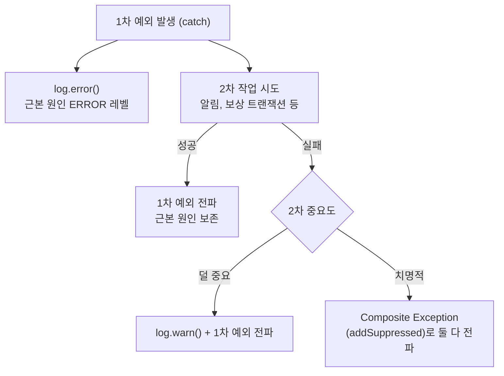

# 예외 처리 정책

## DB 무결성 위반 흐름

Infrastructure 레벨 예외는 Application Layer를 넘어가지 않는다.  
Application 과 Adapter 어디서도 Spring DAO 예외(`DuplicateKeyException`, `DataIntegrityViolationException` 등) 를 catch 하지 않으며, 정상 흐름은 사전 `find` 로 처리하고 DB 무결성 위반은 `GlobalExceptionHandler` 안전망에 위임한다.

### 본질 흐름 — find-first 패턴

```
DB find → 없으면 insert → 충돌 시 500
```

- 사전 `find` 가 정상 멱등/중복 시나리오를 흡수한다 (도메인 4xx 또는 정상 200 흐름).
- `insert` 시점의 unique 위반은 race window 한정이며, 안전망 500 으로 코드 버그처럼 가시화한다.
- NOT NULL / FK / CHECK 위반도 동일하게 안전망 500 으로 전파된다.

### 정책 적용 조건과 한계

본 정책은 다음 두 조건이 모두 만족될 때 유효하다.

1. **트랜잭션이 짧다** — race window 가 좁아 안전망 500 의 발생률이 무시 가능한 수준이다.
2. **정상 흐름에서 동시 충돌 확률이 낮다** — 사용자 입력 식별자(email, merchantPayKey) 나 idempotency key 기반 unique.

조건을 만족하는 현재 적용 대상은 `MemberRegistrationService`, `PaymentApprovalService`, `PaymentApprovalAttemptService`, `PaymentCancellationAttemptService`, `OrderCreateService`, `StockRestoreOutboxConsumeService` 6곳이다.

**비적용 상황**: 충돌이 잦을 것으로 예상되는 시나리오(예: 캐시 미스 후 동시 다발 insert, 대규모 일괄 처리 race) 에는 본 정책을 적용하지 않고 **try-save-catch** 패턴이 더 적합하다. 향후 새 unique 제약을 도입할 때 위 두 조건으로 패턴을 선택하며, try-save-catch 를 선택하더라도 인프라 예외 타입(`DuplicateKeyException` 등) 에 직접 의존하지 않도록 처리한다.

### GlobalExceptionHandler 안전망 계층

```
DataAccessException (부모 핸들러, COMMON-500-2)
├─ DataIntegrityViolationException (COMMON-500-1)            ← unique / NOT NULL / FK / CHECK
│  └─ DuplicateKeyException                                   ← 자동 흡수
└─ OptimisticLockingFailureException (COMMON-409-1)           ← 409 (낙관적 락 정상 시나리오)
```

- Spring `@ExceptionHandler` 는 가장 구체적인 타입을 먼저 매칭한다. 두 구체 핸들러(`DataIntegrityViolationException`, `OptimisticLockingFailureException`) 가 우선 매칭되고, 부모 `DataAccessException` 핸들러는 그 외 DAO 예외(`BadSqlGrammarException`, `CannotAcquireLockException`, `DataAccessResourceFailureException` 등) 만 받는다.
- `DuplicateKeyException` 은 `DataIntegrityViolationException` 의 하위라 별도 등록 없이 자동 흡수된다.
- `DataIntegrityViolationException` 핸들러는 unique race window 와 NOT NULL/FK/CHECK 위반을 모두 잡아 500 + stack trace 로그(`COMMON-500-1`) 를 남긴다.
- `DataAccessException` 부모 핸들러는 DAO 카테고리 fallback 으로 500 + stack trace + `COMMON-500-2` 를 남겨 운영 모니터링에서 일반 `Exception` fallback 과 구분 가능하게 한다.
- `OptimisticLockingFailureException` 핸들러는 낙관적 락 충돌(정상 시나리오) 을 409 로 유지한다.

### JpaConfig 빈 등록 목적

`JpaConfig` 의 `SQLErrorCodeSQLExceptionTranslator` 빈은 안전망 핸들러가 unique 위반을 `DuplicateKeyException` 으로 정확히 분류해 로깅하도록 한다. 코드가 직접 catch 하지는 않지만, 운영 환경(JPA + MySQL) 에서 unique 위반과 그 외 무결성 위반을 로그 레벨로 구분하기 위해 빈 등록은 유지된다.

## 보상 catch 2차 예외 처리

보상 트랜잭션·알림 발송처럼 catch 블록 안에서 2차 작업을 시도해야 할 때의 정책이다. 2차 시도가 또 예외를 던지면 1차 예외(근본 원인)가 가려지거나 보상 흐름 자체가 중단될 수 있다. 본 섹션은 그 경우의 일관된 처리 방식을 정의한다.

### 의사결정 트리



### 원칙

- 1차 예외는 catch 진입 즉시 `log.error()`로 ERROR 레벨에 남긴다.
- 2차 시도가 성공하면 1차 예외만 전파한다(근본 원인 보존).
- 2차 시도가 실패하고 덜 중요한 경우 `log.warn()`으로 기록하고 1차 예외만 전파한다.
- 2차 시도가 실패하고 치명적인 경우 Composite Exception(`addSuppressed`)으로 1차·2차를 둘 다 담아 전파한다.
- 로그 레벨 규약: **1차 = ERROR, 2차 = WARN**.

### 설계 원칙

catch 안에서 호출하는 메서드는 가급적 예외를 던지지 않게 설계한다. 의도(예: "가능하면 실패 처리, 아니면 skip")를 메서드 이름으로 캡슐화해 호출처가 try-catch를 쓰지 않고 의도만 표현하도록 한다. Composite Exception은 catch 안 메서드를 도저히 예외 없이 설계할 수 없는 치명적 경우에만 사용한다.

### 적용 예

- `NaverPayApprovalService.completeVerifiedApproval`의 상위 catch(`PaymentException`, `CustomException`, `Exception`)는 모두 진입 직후 1차 예외를 `log.error`로 남긴다.
- `PaymentApprovalAttemptService.failIfRequested`는 보상 흐름에서 "현재 상태가 REQUESTED면 실패 처리, 아니면 skip" 의도를 캡슐화해 호출처(`NaverPayApprovalService.failApproveAndCancelApprovedPayment`)가 try-catch 없이 평탄하게 보상을 진행하도록 한다.
- `PaymentApprovalService.isCompensationRequired`는 보상 진행 여부를 Payment Aggregate 소유자가 결정하도록 캡슐화해 NaverPay adapter가 Payment 저장소에 직접 접근하지 않도록 한다.
