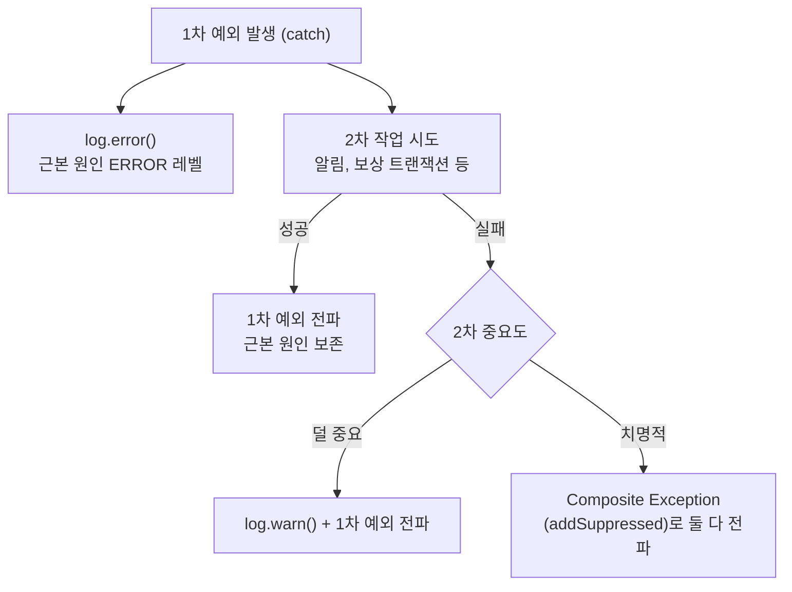

# 예외 처리 정책

## 핵심 원칙 (요약)

> 코딩 시 반드시 지킬 보편 원칙이다. 도메인별 사례·상세는 아래 본문이 단일 출처다.

- **예외 노출 경계는 예외의 추상 수준으로 긋는다**: application·domain·presentation은 특정 구현체(JPA·Hibernate)에 묶인 구체 예외(`org.springframework.orm.*`, `org.hibernate.*`, `jakarta.persistence` 예외)를 참조하지 않는다. 반면 특정 영속성 구현에 묶이지 않은 Spring DAO 추상 예외(`org.springframework.dao.*`, 예: `OptimisticLockingFailureException`·`DataIntegrityViolationException`)는 application이 다뤄도 된다 — Spring은 교체 대상이 아니고 이 계층은 JDBC/JPA/MyBatis를 가리지 않는 추상이기 때문이다. 추상 상위 타입을 잡으면 그 하위 구현체 타입이 다형적으로 걸리므로, 상위 계층이 구현체 타입 이름을 부를 일이 없다. **domain은 추상·구체 어느 영속성 예외도 모른다.**
- **번역은 의무가 아니라 선별적이다**: 기술 예외 → 도메인 예외 번역은 **안쪽이 그 예외에 따라 다르게 처리해야 할 때만** `infrastructure/persistence/` adapter가 한다(유니크 위반 → 이미 존재/이중결제 차단 등). 순수 재시도처럼 그 예외를 따로 처리하지 않으면 번역하지 않고 DAO 추상 예외를 그대로 usecase가 잡거나 끝단 핸들러로 흘려보낸다. 판단축은 "안쪽이 그 예외를 실제로 다루는가"다.
- **find-first 패턴**: 정상 흐름은 사전 `find`로 처리(멱등/중복 흡수). DB 무결성 위반(unique race, NOT NULL/FK/CHECK)은 catch하지 말고 `GlobalExceptionHandler` 안전망(500)에 위임한다. (단 그 위반을 특정 상황으로 구분해 처리해야 하면 adapter에서 도메인 예외로 번역해 4xx로 다룰 수 있다.)
- **충돌이 잦은 시나리오**는 예외적으로 try-save-catch가 더 적합하다. 이때 DAO 추상 예외(`DuplicateKeyException` 등)를 잡는 건 허용되지만, 구현체에 묶인 구체 타입(`org.hibernate.*`·`org.springframework.orm.*`)은 직접 잡지 않는다 — 추상 상위를 잡으면 구체 하위가 다형적으로 걸린다.
- **낙관 락(@Version) 충돌**: tx 경계 밖에서 정책(전파/skip/retry)을 정한다. **순수 재시도**면 usecase가 DAO 추상 예외 `OptimisticLockingFailureException`을 직접 잡아 새 tx로 재시도한다(번역 불필요). **충돌에 따라 다르게 처리**해야 하면 `infrastructure/persistence/` adapter가 `saveAndFlush`로 감지를 당겨 도메인 예외로 번역한다. 상세·근거는 `docs/optimistic-lock-design.md`가 단일 출처. (unique 위반과 달리 충돌은 정상 시나리오라 409 — 아래 "왜 500 vs 409" 참고.)
  - **다시 하는 동안에는 다루지 않고, 소진되면 다룬다.** 재시도 중의 충돌은 그냥 다시 하면 되는 일이라 원형을 그대로 쓴다. 반면 횟수를 다 쓰면 회원에게 답을 줘야 하므로 그때는 도메인 예외로 옮긴다.
  - **재시도하는 자리는 트랜잭션 경계 밖이어야 한다.** 충돌은 커밋 시점에 터지므로, 트랜잭션을 여는 메서드 안에서 잡으면 도달하지 않는 코드가 된다. 이 저장소는 usecase가 트랜잭션을 열지 않고 service를 부르므로 그 자리가 곧 경계 밖이다 — **usecase에 트랜잭션을 붙이는 순간 이 전제가 깨진다.**
- **보상 catch (catch 안 2차 작업)**: 1차 예외는 진입 즉시 `log.error()`(근본 원인 보존). 2차 성공 시 1차만 전파. 2차 실패·덜 중요하면 `log.warn()`+1차 전파. 2차 실패·치명적이면 `addSuppressed`로 둘 다 전파. **레벨: 1차=ERROR. 2차 실패는 덜 중요하면 WARN+1차 전파, 치명적이면 addSuppressed로 둘 다 전파.**
- **catch 안 메서드는 가급적 예외를 안 던지게 설계**하고 의도를 메서드명에 캡슐화한다. Composite Exception은 도저히 안 될 때만.
- **외부 캐시(Redis) 장애**: infra adapter가 `DataAccessException`을 잡아 도메인 예외로 변환한다(port에 DAO 예외 노출 금지). 던지는 예외 타입은 application이 그 장애를 catch해 삼키느냐로 갈린다 — **catch해서 fallback**하면 자동 매핑을 피하는 `RuntimeException` 직접 상속 전용 예외, **catch하지 않으면** 공통 예외 베이스(`CustomException`)로 던져 `UNAVAILABLE`(503) 자동 매핑에 맡긴다.
- **도메인 예외는 전송 계층을 모른다(transport-agnostic)**: 도메인 예외가 든 `ErrorCode`는 HTTP 상태 대신 의미 분류 `ErrorCategory`(`INVALID`·`UNAUTHORIZED`·`FORBIDDEN`·`NOT_FOUND`·`CONFLICT`·`UPSTREAM_ERROR`·`UNAVAILABLE`·`INTERNAL`)만 든다. 카테고리→HttpStatus 매핑은 HTTP를 아는 경계(`GlobalExceptionHandler`·인증 필터·인가 인터셉터)가 `ErrorCategoryHttpStatus`로 소유한다. domain을 HTTP-free로 유지해 추후 모듈 분리 시 web 의존이 새지 않게 하며, ArchUnit이 domain의 `org.springframework.http`·`web` 의존을 금지해 강제한다.
- **결제사 결과 불명(UNKNOWN)**: 결제사 호출은 게이트웨이 port 하나로만 나가고 구현체(어댑터)가 타임아웃·서버 오류·읽지 못한 응답까지 전부 결과 갈래로 접어 돌려주므로, 상위는 예외가 아니라 갈래를 보고 판단한다. 결과를 확정하지 못하면 UNKNOWN으로 남기고 대사가 이력을 읽어 확정한다. UNKNOWN인 결제 시도로 승인이 다시 오면 `PAYMENT_RESULT_PENDING`(409)로, 그 주문을 취소하려 하면 `ORDER_REFUND_NOT_AVAILABLE`(409)로 막는다.

---

## DB 무결성 위반 흐름

무결성 위반은 정상 흐름을 사전 `find` 로 처리하고, 실제 발생하면 `GlobalExceptionHandler` 안전망에 위임한다. `insert` 시점의 unique race는 DAO 추상 예외 `DataIntegrityViolationException` 으로 안전망까지 흘려 500으로 가시화한다(아래 본질 흐름).

**안쪽이 그 위반에 따라 다르게 처리해야 하면 예외적으로 번역한다**: 특정 유니크 제약이 명확한 비즈니스 개념에 1:1 대응하고 안쪽이 그에 따라 처리를 달리하면, `infrastructure/persistence/` adapter가 제약을 식별해 도메인 예외로 번역한다. 이때도 adapter는 DAO 추상 상위(`DataIntegrityViolationException`)를 잡지, 구현체에 묶인 구체 타입(`org.hibernate.*`·`jakarta.persistence.*`)을 잡지 않는다. 제약 이름은 그 예외의 원인에 담겨 있어 **어댑터 안에서만** 들여다본다.

**제약명을 식별하는 자리가 하나 있다 — 환불을 저장하는 persistence adapter다.** 주문 취소가 주문·환불·재고·결제를 **한 트랜잭션에 저장해 유일 제약 위반과 필수값 누락·외래 키 위반이 같은 예외로 도착하기 때문**이다. 앞엣것만 회원에게 "잠시 후 다시"라고 답할 수 있고 나머지는 회원이 할 수 있는 일이 없는 결함이라 안전망으로 보내야 하므로, 제약 이름을 볼 수 있는 그 자리에서 가른다. 유스케이스는 옮겨진 도메인 예외만 잡는다.

**결제 시작은 아직 번역하지 않는다.** 그 트랜잭션은 결제 한 테이블만 저장하고, 부딪힐 수 있는 유일 제약 셋이 모두 **"같은 자리를 다른 요청이 먼저 잡았다"는 뜻이 같아** 가릴 것이 없다. 그래서 번역 없이 usecase가 DAO 추상 예외(`DataIntegrityViolationException`)를 그대로 잡아 회원용 409로 바꾼다. 판단축은 **"안쪽이 그 예외를 실제로 다루는가"**이며, 결제 시작도 여러 테이블을 함께 저장하게 되면 같은 판단으로 넘어온다.

> **제약 이름을 바꾸면 어댑터도 함께 고친다.** 마이그레이션에서 이름만 바꾸면 어댑터의 판정이 조용히 어긋나는데, **컴파일도 단위 검증도 통과하고 실제 DB를 쓰는 검증만 잡는다.**

### 본질 흐름 — find-first 패턴

```
DB find → 없으면 insert → 충돌 시 500
```

- 사전 `find` 가 정상 멱등/중복 시나리오를 흡수한다 (도메인 4xx 또는 정상 200 흐름).
- `insert` 시점의 unique 위반은 race window 한정이며, 안전망 500 으로 코드 버그처럼 가시화한다.
- NOT NULL / FK / CHECK 위반도 동일하게 안전망 500 으로 전파된다.

### 정책 적용 조건과 한계

본 정책은 다음 두 조건이 모두 만족될 때 유효하다.

1. **트랜잭션이 짧다** — race window 가 좁아 안전망 500 의 발생률이 무시 가능한 수준이다.
2. **정상 흐름에서 동시 충돌 확률이 낮다** — 사용자 입력 식별자(email 등) 나 우리가 발급한 키·idempotency key 기반 unique.

위 두 조건(짧은 트랜잭션 + 낮은 동시 충돌 확률)을 만족하는 서비스에 적용한다. 적용되는 서비스의 정확한 목록은 코드(`com.commerce.<domain>`)가 단일 출처이며, 본 문서는 하나하나 다 적지 않는다(클래스명이 바뀌면 문서가 안 맞게 되므로). 대표적으로 회원 가입·결제 승인/이력·주문 생성 등 사용자 입력 식별자나 idempotency key 기반 unique를 쓰는 경로가 해당한다.

**비적용 상황**: 충돌이 잦을 것으로 예상되는 시나리오(예: 캐시 미스 후 동시 다발 insert, 대규모 일괄 처리 race) 에는 본 정책을 적용하지 않고 **try-save-catch** 패턴이 더 적합하다. 향후 새 unique 제약을 도입할 때 위 두 조건으로 패턴을 선택하며, try-save-catch 를 선택하더라도 DAO 추상 예외(`DuplicateKeyException` 등)를 잡는 건 허용되지만 구현체에 묶인 구체 타입(`org.hibernate.*`·`org.springframework.orm.*`)은 직접 잡지 않는다 — 추상 상위를 잡으면 구체 하위가 다형적으로 걸린다.

### GlobalExceptionHandler 안전망 계층

```
DataAccessException (부모 핸들러, COMMON-500-2)
├─ DataIntegrityViolationException (COMMON-500-1)            ← unique / NOT NULL / FK / CHECK
├─ OptimisticLockingFailureException (COMMON-409-1)           ← 409 (낙관적 락 정상 시나리오)
└─ PessimisticLockingFailureException (COMMON-500-3)          ← 락 대기 타임아웃 / 데드락
```

- Spring `@ExceptionHandler` 는 가장 구체적인 타입을 먼저 매칭한다. 세 구체 핸들러(`DataIntegrityViolationException`, `OptimisticLockingFailureException`, `PessimisticLockingFailureException`) 가 우선 매칭되고, 부모 `DataAccessException` 핸들러는 그 외 DAO 예외(`BadSqlGrammarException`, `DataAccessResourceFailureException` 등) 만 받는다.
- unique 위반은 `DataIntegrityViolationException`(cause=Hibernate `ConstraintViolationException`) 으로 올라와 같은 핸들러에 흡수된다 (translator 빈 제거 후 형태, → PR#228).
- `DataIntegrityViolationException` 핸들러는 unique race window 와 NOT NULL/FK/CHECK 위반을 모두 잡아 500 + stack trace 로그(`COMMON-500-1`) 를 남긴다.
- `DataAccessException` 부모 핸들러는 DAO 카테고리 fallback 으로 500 + stack trace + `COMMON-500-2` 를 남겨 운영 모니터링에서 일반 `Exception` fallback 과 구분 가능하게 한다.
- `OptimisticLockingFailureException` 핸들러는 낙관적 락 충돌(정상 시나리오) 을 409 로 유지한다.
- `PessimisticLockingFailureException` 핸들러는 비관적 락 경합 실패를 500 + stack trace + `COMMON-500-3` 으로 남긴다. 하위인 `CannotAcquireLockException`(락 대기 타임아웃) 과 `DeadlockLoserDataAccessException`(데드락) 이 함께 걸린다. 삼키지 않으므로 rollback 동작과 회원 응답 상태코드는 그대로다.

> **왜 unique 위반은 500인데 낙관 락 충돌은 409인가** — 둘 다 동시성 충돌이지만 의미가 반대다.
> unique race는 find-first를 제대로 썼다면 정상 흐름에선 거의 안 나야 하는 것이라, 나면 코드 버그처럼
> 가시화(500)한다. 낙관 락 충돌은 같은 행을 동시 전이할 때 *정상적으로 발생할 수 있는* 것이라 재시도/대기를
> 유도하는 409로 둔다. 즉 "안 나야 정상 → 500", "날 수 있는 정상 → 409".

### unique 위반 제약명 식별 (→ PR#228)

`JpaConfig` 의 `SQLErrorCodeSQLExceptionTranslator` 빈은 제거됐다. 이 빈은 `db-constraint-violation-handling` 에서 application 의 `DuplicateKeyException` catch 를 위해 등록됐으나 그 catch 는 find-first 전환(→ PR#109)으로 폐기됐고, 남은 정당화("운영 로그에서 `DuplicateKeyException` 타입 구분")는 무가치했다 — 빈 유무와 무관하게 unique 위반은 같은 핸들러·같은 `COMMON-500-1` 로 분류되고 `Duplicate entry ... for key ...` `SQLException` 메시지가 cause 체인에 남는다.

빈 제거 후 unique 위반은 `DataIntegrityViolationException`(cause=Hibernate `ConstraintViolationException`(cause=`SQLException`)) 으로 올라온다. **지금은 제약명을 읽는 코드가 없다** — 위 "DB 무결성 위반 흐름"에 적었듯 어느 제약이든 처리가 같아 가릴 이유가 없기 때문이다.

제약을 가려야 하는 자리가 생기면 Hibernate `ConstraintViolationException.getConstraintName()` 을 쓰되 다음 둘을 지킨다. MySQL 환경에서 이 값은 테이블 prefix 를 포함하므로(`tbl_payment.uk_payment_active_order_key`) 전체 제약명을 대소문자 무시(`equalsIgnoreCase`)로 비교한다. 그리고 Hibernate API 에 닿는 것이므로 그 코드는 `infrastructure/persistence/` adapter 안에 둔다 — 이미 JPA 전용이라 그 의존이 자연스럽다.

---

## 낙관 락(@Version) 충돌 흐름

`@Version` 기반 낙관 락 충돌(`OptimisticLockingFailureException` / `ObjectOptimisticLockingFailureException`)의 처리 정책이다. unique 위반(위)과 달리 충돌은 *정상적으로 발생할 수 있는* 시나리오이므로 다르게 다룬다. **상세·근거·코드 스케치는 `docs/optimistic-lock-design.md`가 단일 출처**이며, 본 절은 예외 처리 관점의 규칙만 요약한다.

### 핵심 규칙

- **tx 경계 안에서는 충돌을 catch하지 않는다.** 변환된 도메인 예외를 전파시켜 트랜잭션을 깨끗이 rollback한다. 경계 안에서 catch하면 `REQUIRES_NEW`라도 커밋 시 `UnexpectedRollbackException`이 난다(충돌 후 tx는 rollback-only).
- **skip / retry / 전파 결정(정책)은 tx 경계 밖에서** 한다. 같은 tx 단위작업을 호출 맥락에 따라 전파(→409)·skip(보상)·retry(고경합)로 재사용한다.
- **번역은 선별적이다.** 순수 재시도나 순수 전파면 번역하지 않는다 — 커밋 시점 예외가 tx 경계 밖으로 그대로 전파되므로 usecase가 DAO 추상 예외 `OptimisticLockingFailureException`을 직접 잡거나 끝단 핸들러가 409로 받는다. 반대로 충돌에 따라 *다르게 처리*해야 하면, adapter가 `saveAndFlush`로 감지를 커밋 전으로 당겨 `infrastructure/persistence/`에서 도메인 예외로 번역한다(그래야 예외가 adapter 메서드 안에서 터져 잡을 수 있다).
- **`saveAndFlush`를 쓴다고 번역해야 하는 것은 아니다.** 즉시 flush가 필요한 이유는 충돌 번역 말고도 있다 — 한 트랜잭션 안에서 **쓰기 순서**를 강제해야 할 때가 그렇다. 그래서 저장 port 메서드는 *구현*이 아니라 **부르는 쪽이 무엇에 기대는지**로 갈리고, 이름이 그 기대를 말한다. 상세는 design 문서 3장.

### 도메인 예외의 상속 전략 — 자동 매핑을 원하느냐로 갈린다

같은 "도메인 예외"라도 **`GlobalExceptionHandler`의 자동 응답 매핑을 원하느냐**에 따라 상속 전략이 갈린다. 판단축은 도메인(충돌이냐 인프라 장애냐)이 아니라 **application이 그 예외를 catch해서 삼키느냐**다.

| 상황 | 상속 | 이유 |
|---|---|---|
| catch 안 하고 끝단 응답으로 전파 | `CustomException` 류 | 카테고리→상태코드로 **자동 매핑되길 원함**(예: 낙관 락 충돌 409, 인프라 일시 장애 503) |
| catch해서 삼킴(fallback·보상) | `RuntimeException` 직접(전용 타입) | 자동 매핑을 **회피**해야 함(application이 잡아 처리하므로) |

→ `RuntimeException` 직접 상속은 "인프라 장애 한정" 규칙이 아니라 **"catch해서 삼킬 예외 한정"** 규칙이다. catch하지 않고 끝단 응답으로 흘려보낼 예외는 충돌이든 인프라 장애든 `CustomException` 자동 매핑을 활용한다.

### 의미 코드 vs 일반 코드

충돌을 도메인 예외로 변환할 때 기본은 **일반 충돌 코드**다 — 엔티티별로 하나씩 두고(결제는 `PAYMENT_CONCURRENTLY_MODIFIED`, 환불은 `REFUND_CONCURRENTLY_MODIFIED`), 상태가 필요하면 재조회로 판정한다. 그 경로에서 충돌이 단일 비즈니스 의미로 1:1 대응할 때만 의미 코드로 좁히며, 의미 코드는 그 행의 동시 쓰기 경로가 하나뿐일 때만 정직하다(경로가 늘면 거짓 양성). **지금 이 저장소에는 의미 코드가 없다** — 결제도 환불도 동시 쓰기 경로가 여럿이라 1:1이 성립하지 않는다. 상세는 design 문서 5장.

### 기계 검증

다음 규칙은 ArchUnit 테스트(`ArchitectureRulesTest`)로 강제한다. 문서는 "왜"의 포인터, 테스트는 "무엇이 강제되나"의 단일 출처다.

- **구현체에 묶인 구체 예외**(`org.springframework.orm.*`, `org.hibernate.*`, `jakarta.persistence` 예외)는 **application·domain·presentation에 노출 금지**. 추상 상위(`org.springframework.dao.*`)를 잡으면 하위 구현체 타입이 다형적으로 걸리므로 상위 계층이 구현체 타입 이름을 쓸 일이 없다.
- **domain은 `org.springframework.dao.*` 추상 예외도 참조 금지**(가장 안쪽, 순수). application은 DAO 추상 예외를 허용.
- `saveAndFlush`는 `infrastructure.persistence`에서만 호출.
- presentation Controller는 낙관 락 충돌 예외를 catch하지 않는다(전파 → application 재시도 또는 끝단 409 매핑).
- **domain은 `org.springframework.http`·`org.springframework.web`(HTTP/web 타입) 참조 금지** — 도메인 예외가 상태코드 대신 `ErrorCategory`만 들도록.

---

## Redis 캐시 장애 처리

외부 캐시(Redis) 장애는 *infra adapter의 도메인 예외 변환 + 끝단 정책 결정(application catch fallback 또는 GlobalExceptionHandler 자동 매핑)* 으로 처리한다. 캐시는 커스텀 아웃바운드 port(`application/port/`)이고 그 계약이 Spring·영속성 예외 타입을 노출하면 안 되므로 adapter가 도메인 예외로 변환한다 — 낙관 락과 달리 실패가 adapter 메서드 안에서 동기적으로 잡히므로 그 자리에서 변환할 수 있다.

### 본질 흐름

```
Infra adapter: DataAccessException catch → 도메인 예외 변환 (log.error)
끝단: 도메인 예외를 받아 정책 결정 (application catch fallback 또는 GlobalExceptionHandler 자동 매핑)
```

- Infra 는 *기술적 사실* (어떤 예외인지) 만 알면 되고, *어떻게 대응할지* 는 끝단의 정책이다.
- port 시그니처에 Spring `DataAccessException` 이 노출되지 않아 port 추상화가 보존된다.
- 변환한 도메인 예외의 상속은 *application이 catch해서 삼키느냐* 로 갈린다(위 "도메인 예외의 상속 전략" 참고). catch해서 fallback하면 자동 매핑을 피하는 `RuntimeException` 직접 상속 전용 예외, catch하지 않으면 공통 예외 베이스로 던져 `UNAVAILABLE`(503) 자동 매핑에 맡긴다.
- 두 패턴으로 갈린다(정확한 적용처는 코드가 단일 출처):
  - **catch해서 fallback** — 캐시가 latency 최적화 레이어이고 원본(DB)으로 대체 가능한 경로. application이 전용 예외를 잡아 안전망 경로로 진행한다.
  - **catch 없이 자동 매핑** — 캐시가 저장소 자체라 대체 불가한 경로. 공통 예외로 던져 `UNAVAILABLE`(503)로 응답한다.

### 정책 결정 위치 — catch 여부로 갈린다

매핑 단계(infra adapter)는 어느 도메인이든 동일하다. 변환 이후 *정책 결정* 은 application이 그 예외를 catch하느냐로 두 갈래로 분기한다.

- **catch해서 fallback** — application이 전용 예외를 catch해 안전망 경로로 진입. fallback 진입이라는 *정책 결정 사실* 이 있어 WARN 로그 가치도 있다. 삼켜야 하므로 자동 매핑을 피하는 `RuntimeException` 직접 상속 전용 예외다.
- **catch 안 함** — application은 catch하지 않는다. 공통 예외(`UNAVAILABLE` 코드)가 그대로 전파되어 끝단 핸들러가 503으로 자동 매핑한다. 전용 예외 클래스도 도메인 전용 advice도 필요 없다.

과거에는 catch 안 하는 케이스를 도메인 모듈의 전용 `@RestControllerAdvice`가 받았으나(도메인마다 advice·`@Order`·테스트가 늘어나는 부담), 인프라 일시 장애용 `UNAVAILABLE`(503) 카테고리를 도입하면서 공통 예외 자동 매핑으로 대체하고 그 advice는 폐기했다.

**공통 인프라 장애 베이스 예외는 만들지 않는다.** catch 안 하는 케이스는 도메인 예외 클래스로 `UNAVAILABLE` 자동 매핑을 쓰므로 베이스가 불필요하고, catch해서 삼키는 fallback 케이스는 **자리가 늘어도 각자 자기 도메인의 전용 타입 하나만 잡는다** — 여러 타입을 한 catch에 묶는 자리가 없어 베이스가 할 일이 없다. 서로 다른 도메인의 장애를 한 자리에서 함께 잡아야 하는 시나리오가 실제로 생기면 그때 베이스 추출을 재검토한다.

### 로깅 규약

- infra adapter (저장소 실패 자체): 장애 사실을 로그로 남기고 도메인 예외의 cause로 원인을 실어 전파한다. 스택을 남기는 위치는 catch 여부로 갈린다.
- catch해서 fallback: fallback 진입을 WARN + 메타데이터로 남긴다(정상 흐름의 분기 결정 기록).
- catch 안 함: adapter는 요청 컨텍스트만 WARN으로 남기고(스택 제외), 전파된 예외가 5xx이므로 끝단 핸들러가 ERROR로 원인 stack을 한 번 남긴다(스택 중복 회피).

---

## 보상 catch 2차 예외 처리

보상 트랜잭션·알림 발송처럼 catch 블록 안에서 2차 작업을 시도해야 할 때의 정책이다. 2차 시도가 또 예외를 던지면 1차 예외(근본 원인)가 가려지거나 보상 흐름 자체가 중단될 수 있다. 본 섹션은 그 경우의 일관된 처리 방식을 정의한다.

전체 로깅 규칙(레벨 기준, 마스킹, 포맷 등)은 `docs/logging-conventions.md`를 참고한다.

### 의사결정 트리



### 원칙

- 1차 예외는 catch 진입 즉시 `log.error()`로 ERROR 레벨에 남긴다.
- 2차 시도가 성공하면 1차 예외만 전파한다(근본 원인 보존).
- 2차 시도가 실패하고 덜 중요한 경우 `log.warn()`으로 기록하고 1차 예외만 전파한다.
- 2차 시도가 실패하고 치명적인 경우 Composite Exception(`addSuppressed`)으로 1차·2차를 둘 다 담아 전파한다.
- 로그 레벨 규약: **1차 = ERROR. 2차 실패는 덜 중요하면 WARN(+1차 전파), 치명적이면 addSuppressed로 둘 다 전파**(WARN으로 끝나지 않음).

### 설계 원칙

catch 안에서 호출하는 skip 로직은 가급적 예외를 던지지 않게 설계한다. "조건 안 맞으면 조용히 skip"이라는 의도를 캡슐화해 호출처가 try-catch 없이 평탄하게 보상을 진행하도록 한다. **이 skip 로직은 보통 그것을 쓰는 흐름 하나에만 의미가 있으므로, 별도 클래스가 아니라 그 흐름을 가진 Service 안의 private 메서드로 둔다**(여러 Service가 공유할 때만 추출). 자세한 배치 기준은 `docs/optimistic-lock-design.md`·`docs/package-structure-conventions.md` 참조. Composite Exception은 catch 안 로직을 도저히 예외 없이 설계할 수 없는 치명적 경우에만 사용한다.

### 적용 예

> 아래는 원칙이 적용된 *예시*다(완전한 목록 아님). 클래스·메서드명은 코드가 단일 출처이므로 예시가 낡아도 원칙 자체는 유지된다.

- **커밋 뒤 후속 호출이 실패해도 1차 결과를 흔들지 않는다** — 예: 주문 취소와 승인 반려는 되돌릴 근거(취소·환불 생성)를 먼저 커밋하고, 그 뒤 결제사 발송 호출이 실패하면 `log.error`로 남기고 흐름을 그대로 끝낸다. 환불은 접수 상태로 남아 발송 배치가 다시 보낸다. 여기서 예외를 전파시키면 회원은 취소가 안 된 줄 알고 다시 요청하는데 주문은 이미 취소돼 있다.
- **보상 catch 안 skip은 예외를 안 던지고 흐름을 멈추지 않는다** — 예: 환불 발송 흐름이 "부르기 직전 전이"와 "결과 반영 전이"에서 각각 충돌·가드 위반을 private 메서드로 흡수한다. 충돌은 "다른 주체가 같은 건을 먼저 옮겼다"는 뜻이고 돈이 어떻게 됐는지는 대사가 이력으로 확정하므로, 그 자리에서 판정을 강행하지 않고 물러난다.
- **사실 조회와 정책 적용을 분리한다** — 예: "환불 가능 금액이 얼마 남았는가"라는 *사실*은 결제 엔티티가 자기 값으로 판정하고, 그 결과로 무엇을 할지는 호출한 흐름이 정한다. 이는 낙관 락 충돌에서 "상태가 필요하면 예외가 아니라 재조회로 판정한다"(design 문서 5장)와 같은 사상 — *충돌·사실은 예외로 드러내되, 그걸 어떻게 쓸지는 호출한 쪽의 정책*.
- **find-first의 예외적 허용 — 충돌 자체가 회원에게 답할 사실일 때**: 결제 시작과 주문 취소는 사전 `find`로 멱등 요청을 흡수한 뒤에도 race window가 남고, 그때 유일 제약 위반(`DataIntegrityViolationException`)이 나는 것은 *같은 자리를 다른 요청이 먼저 잡았다*는 뜻이다. 코드 버그가 아니라 회원에게 "잠시 후 다시"라고 답할 사실이므로 안전망 500으로 흘리지 않고 usecase가 잡아 409로 바꾼다.

### 결제사 호출 결과

**결제사로 나가는 통로는 `application/port/`의 게이트웨이 인터페이스 하나이고, 결제사 하나가 구현체(어댑터) 하나로 붙는다.** 결제사 전용 응답 타입·에러 코드·클라이언트는 `infrastructure/pg/<결제사>/` 안에서만 참조되고, application은 결제사 어휘가 없는 port dto만 본다 — 레이어 의존 방향이 이렇게 보존되며, 이 방향은 ArchUnit이 강제한다.

**어댑터는 예외를 던지지 않는다.** 타임아웃도, 서버 오류도, 읽지 못한 응답도 전부 결과 갈래로 접어 돌려주므로, 부르는 쪽은 "예외를 놓치면 무슨 일이 나는가"를 따지지 않고 갈래만 보고 분기한다.

**결과 갈래는 넷이다** — 됐다 / 모른다 / 다시 시도할 수 있는 실패 / 다시 시도할 수 없는 실패.

- **두 실패를 가르는 것이 이 목록의 핵심이다.** 실패가 하나면 무엇을 할지 정할 수 없다 — 점검·요청 제한처럼 시간이 지나면 풀리는 것은 상태를 그대로 두고 다시 보내야 하고, 같은 요청에 같은 답이 오는 것은 사람에게 넘겨야 한다.
- **"모른다"를 실패로 접지 않는다.** 요청이 처리됐을 수 있어 실패로 단정하면 나간 돈을 안 나간 것으로 다루게 된다. 답을 받았는지 여부가 함께 실려 오며, 그 값으로 이력을 읽을지 결과 불명으로 남길지가 갈린다.
- **다시 시도할 수 없는 실패에만 검토 코드가 실린다.** 어느 결제사 응답 코드가 어느 검토 코드인지는 결제사마다 다르므로 어댑터가 정한다.

**대사가 다시 보내는 것도 같은 경계를 지난다.** 결과를 회수하다 이력에 우리 시도가 없으면 그 자리에서 같은 멱등키로 다시 보내는데, 그 호출도 같은 port를 통과해 같은 넷으로 돌아온다. 대사에 별도 통로를 두면 갈래 해석이 두 벌이 된다.

---

## 결제 결과 UNKNOWN 처리

결제사 호출 결과가 확인되지 않아 결제 상태가 불명확한 경우의 처리 정책이다.

### 마킹 정책

- 결과 갈래가 "모른다"이고 **답을 받지 못했으면** 그 결제를 UNKNOWN으로 남긴다. 답은 받았는데 그 답이 결과를 정하지 못한 경우는 먼저 이력을 읽고, 그래도 확정하지 못하면 UNKNOWN으로 남긴다.
- UNKNOWN은 "결과를 알 수 없다"는 사실을 DB에 남기는 것이 목적이다. 그 시도로 다시 부르는 것을 허용하면 이중결제 위험이 있으므로 차단한다.
- **그 자리에서 승인을 다시 부르지 않는다.** 결제사가 원천사로 승인을 보내 놓고 기다리는 중일 수 있어 가장 위험한 구간이다.
- **이력이 비었다는 것만으로 실패를 확정하지 않는다.** 돈이 안 나간 것과 결제사가 아직 반영하지 않은 것을 구분하지 못한다. 반대로 승인 이력이 있고 우리 결제 키가 실려 있으면 확정적이므로 그대로 확정한다.
- **승인 금액이 0 이하처럼 정상 경로에서 나올 수 없는 값이면 확정하지 않고 결과 불명으로 둔다.** 담아 두면 한도가 처음부터 0이라 되돌릴 환불을 만들 수 없는 행이 남는다.
- 환불 호출이 결과를 못 받으면 **환불 행**이 결과 불명으로 남는다. 환불은 결제와 별개 테이블이라 결제의 결과 불명 판정에 섞이지 않으며, 환불 대사가 이력을 읽어 확정한다.

### 차단 정책

- UNKNOWN인 결제 시도로 승인이 다시 오면 `PAYMENT_RESULT_PENDING`(409)로 막는다. 판단은 그 결제 행의 상태다.
- 그 주문에 UNKNOWN인 결제가 있으면 주문 취소를 `ORDER_REFUND_NOT_AVAILABLE`(409)로 막는다. 판단은 `existsUnknownByOrderId(orderId)`이며, 얼마를 돌려줘야 하는지가 아직 정해지지 않았기 때문이다.
- 같은 주문의 **새 결제 시작**은 이 조회로 막지 않는다. 살아 있는 결제가 주문 자리를 쥐고 있고 그 자리에 유일 제약이 걸려 있어, 앞선 결제가 종결돼 자리를 놓기 전에는 새 결제가 들어오지 못한다.
- 회원에게는 "결제 결과 확인 중입니다"로 안내한다.

### 해소 정책

- UNKNOWN은 후처리 배치가 해소한다. 결제 대사가 결과를 모르는 결제를 훑어 이력을 읽고 확정하며, 확정하지 못한 채 오래 남으면 통지 배치가 사람에게 알린다.
- 대사는 **집었다는 사실을 결제사 호출 전에 따로 커밋한다.** 결과 반영과 한 트랜잭션으로 묶으면 호출이 실패했을 때 집은 사실까지 롤백되어 다시 집는 간격이 오르지 않고, 장애가 길어질수록 우리가 더 세게 두드리게 된다.

---

## 승인 재요청 응답

같은 결제 시도로 승인 요청이 다시 도착했을 때의 처리 정책이다. **결제 행의 상태 하나로 갈린다** — 이를 위해 별도 행을 두지 않는다.

| 그 결제 시도의 상태 | 응답 |
|---|---|
| 성공 | **200 OK + 앞서 확정된 결과.** 차단이 아니다 |
| 부른 뒤 결과를 기다리는 중 · 결과 불명 | `PAYMENT_RESULT_PENDING`(409) — 위 차단 정책 |
| 실패·반려·만료로 종결됨 | `PAYMENT_ATTEMPT_CLOSED`(409) |
| 아직 안 부름 | 결제사에 승인을 요청한다 |

- **성공한 건을 막지 않고 흡수하는 이유**: 결제창 복귀는 한 번 결제에 한 번이므로 같은 시도의 중복 도착은 동일 결과 재반환이 맞다. 막으면 *결제는 됐는데 회원이 확인할 수 없는* 상태가 된다.
- **종결된 건은 흡수하지 않는 이유**: 우리가 종결해도 결제사 쪽 결제창은 살아 있어 옛 창의 인증이 여기로 돌아온다. 성공처럼 흡수하면 종결된 시도가 되살아나므로, 그 시도로는 더 진행할 것이 없다고 답하고 다시 시작하게 한다.
