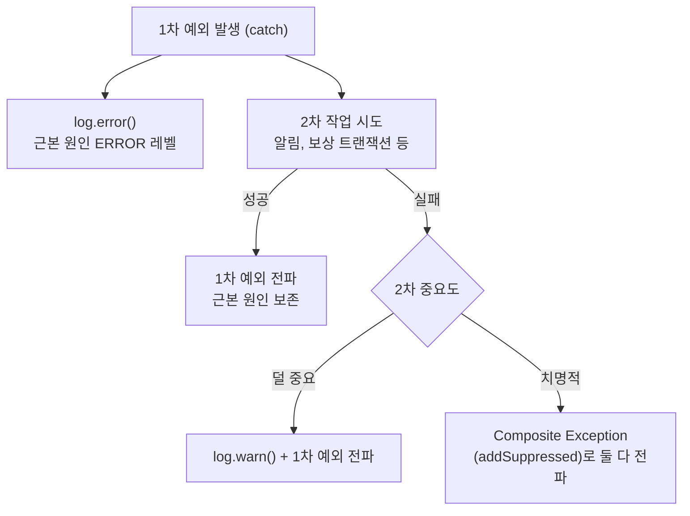

# 예외 처리 정책

## DB 무결성 위반 흐름

Infrastructure 레벨 예외는 Application Layer를 넘어가지 않는다.  
Application 과 Adapter 어디서도 Spring DAO 예외(`DuplicateKeyException`, `DataIntegrityViolationException` 등) 를 catch 하지 않으며, 정상 흐름은 사전 `find` 로 처리하고 DB 무결성 위반은 `GlobalExceptionHandler` 안전망에 위임한다.

### 본질 흐름 — find-first 패턴

```
DB find → 없으면 insert → 충돌 시 500
```

- 사전 `find` 가 정상 멱등/중복 시나리오를 흡수한다 (도메인 4xx 또는 정상 200 흐름).
- `insert` 시점의 unique 위반은 race window 한정이며, 안전망 500 으로 코드 버그처럼 가시화한다.
- NOT NULL / FK / CHECK 위반도 동일하게 안전망 500 으로 전파된다.

### 정책 적용 조건과 한계

본 정책은 다음 두 조건이 모두 만족될 때 유효하다.

1. **트랜잭션이 짧다** — race window 가 좁아 안전망 500 의 발생률이 무시 가능한 수준이다.
2. **정상 흐름에서 동시 충돌 확률이 낮다** — 사용자 입력 식별자(email, merchantPayKey) 나 idempotency key 기반 unique.

조건을 만족하는 현재 적용 대상은 `MemberRegistrationService`, `PaymentApprovalService`, `PaymentApprovalAttemptService`, `PaymentCancellationAttemptService`, `OrderCreateService`, `StockRestoreOutboxConsumeService` 6곳이다.

**비적용 상황**: 충돌이 잦을 것으로 예상되는 시나리오(예: 캐시 미스 후 동시 다발 insert, 대규모 일괄 처리 race) 에는 본 정책을 적용하지 않고 **try-save-catch** 패턴이 더 적합하다. 향후 새 unique 제약을 도입할 때 위 두 조건으로 패턴을 선택하며, try-save-catch 를 선택하더라도 인프라 예외 타입(`DuplicateKeyException` 등) 에 직접 의존하지 않도록 처리한다.

### GlobalExceptionHandler 안전망 계층

```
DataAccessException (부모 핸들러, COMMON-500-2)
├─ DataIntegrityViolationException (COMMON-500-1)            ← unique / NOT NULL / FK / CHECK
│  └─ DuplicateKeyException                                   ← 자동 흡수
└─ OptimisticLockingFailureException (COMMON-409-1)           ← 409 (낙관적 락 정상 시나리오)
```

- Spring `@ExceptionHandler` 는 가장 구체적인 타입을 먼저 매칭한다. 두 구체 핸들러(`DataIntegrityViolationException`, `OptimisticLockingFailureException`) 가 우선 매칭되고, 부모 `DataAccessException` 핸들러는 그 외 DAO 예외(`BadSqlGrammarException`, `CannotAcquireLockException`, `DataAccessResourceFailureException` 등) 만 받는다.
- `DuplicateKeyException` 은 `DataIntegrityViolationException` 의 하위라 별도 등록 없이 자동 흡수된다.
- `DataIntegrityViolationException` 핸들러는 unique race window 와 NOT NULL/FK/CHECK 위반을 모두 잡아 500 + stack trace 로그(`COMMON-500-1`) 를 남긴다.
- `DataAccessException` 부모 핸들러는 DAO 카테고리 fallback 으로 500 + stack trace + `COMMON-500-2` 를 남겨 운영 모니터링에서 일반 `Exception` fallback 과 구분 가능하게 한다.
- `OptimisticLockingFailureException` 핸들러는 낙관적 락 충돌(정상 시나리오) 을 409 로 유지한다.

### JpaConfig 빈 등록 목적

`JpaConfig` 의 `SQLErrorCodeSQLExceptionTranslator` 빈은 안전망 핸들러가 unique 위반을 `DuplicateKeyException` 으로 정확히 분류해 로깅하도록 한다. 코드가 직접 catch 하지는 않지만, 운영 환경(JPA + MySQL) 에서 unique 위반과 그 외 무결성 위반을 로그 레벨로 구분하기 위해 빈 등록은 유지된다.

## Redis 캐시 장애 처리

외부 캐시(Redis) 장애는 fallback 가능 여부와 무관하게 *infra adapter의 도메인 예외 매핑 + application/presentation의 정책 결정* 으로 처리한다. application이 Spring `DataAccessException`에 직접 의존하지 않아 port 추상화가 보존된다.

### 본질 흐름

```
Infra adapter: DataAccessException catch → *StoreUnavailableException 도메인 예외 변환 (log.error)
Application/Presentation: 도메인 예외를 받아 정책 결정 (fallback 진입 또는 응답 매핑)
```

- Infra 는 *기술적 사실* (어떤 예외인지) 만 알면 되고, *어떻게 대응할지* 는 application/presentation 의 정책.
- port 시그니처에 Spring `DataAccessException` 이 노출되지 않아 port 추상화가 보존된다.
- 도메인 예외는 `RuntimeException` 직접 상속 (`CustomException` 상속 시 `GlobalExceptionHandler.handleCustomException` 가 자동 응답 매핑되어 *책임 분리* 또는 *application catch 의도* 가 우회됨).
- 적용처:
  - `OrderIdempotencyStore` ↔ `OrderCreateService` (`order-idempotency-cache-simplification`, application catch + fallback).
  - `RefreshTokenStore` ↔ `RedisRefreshTokenStore` ↔ `AuthExceptionHandler` (`auth-refresh-token-store-unavailable`, presentation 위임 + 응답 매핑).

### catch 위치 분기 — application vs presentation

매핑 단계(infra adapter)는 어느 도메인이든 동일하다. 변환 이후 *정책 결정 위치* 는 fallback 가능 여부에 따라 두 갈래로 분기한다.

- **fallback 가능 (Order)** — application이 도메인 예외를 catch해 DB unique 안전망 경로로 fallback 진입. fallback 진입이라는 *정책 결정 사실* 이 있어 WARN 로그 가치도 있다.
- **fallback 불가 (Auth)** — application은 catch하지 않는다. 도메인 모듈의 `@RestControllerAdvice` (`AuthExceptionHandler`)가 도메인 예외를 받아 `AUTH-500-1` 500 응답으로 매핑. *단순 변환 보일러플레이트* 와 *중복 로그* 가 모두 사라진다.

패턴 선택의 분기점은 fallback 가능 여부가 아니라 *application 정책 결정 내용* 이다. 매핑 구조(infra adapter → 도메인 예외) 자체는 공통 규약이다.

**도메인-specific `@RestControllerAdvice`** 는 *도메인 모듈 안에* 둔다 (`common`이 도메인을 import하는 역의존 회피). 우선순위/범위 한정은 사용처가 늘어났을 때 재검토.

**베이스 클래스** (`StoreUnavailableException`) 추출은 Payment/Stock 등 3곳 이상 사용처가 등장하고 공통 catch 시나리오가 실제로 필요해진 시점에 별도 검토 (현재 YAGNI).

### 로깅 규약

- infra adapter (저장소 실패 자체): ERROR + stack — 운영자가 외부 시스템 장애를 즉시 인지.
- application (fallback 분기 결정): WARN + 메타데이터 — 정상 흐름의 fallback 진입 사실 기록.
- fallback 불가 케이스 (Auth): application과 presentation 모두 로그를 남기지 않는다. infra ERROR + stack으로 운영 인지가 보장되며, 정책 결정 사실 (`AUTH-500-1` 응답 매핑)은 운영 로그에서 별도 식별 가치가 없다.

## 보상 catch 2차 예외 처리

보상 트랜잭션·알림 발송처럼 catch 블록 안에서 2차 작업을 시도해야 할 때의 정책이다. 2차 시도가 또 예외를 던지면 1차 예외(근본 원인)가 가려지거나 보상 흐름 자체가 중단될 수 있다. 본 섹션은 그 경우의 일관된 처리 방식을 정의한다.

전체 로깅 규칙(레벨 기준, 마스킹, 포맷 등)은 `docs/logging-conventions.md`를 참고한다.

### 의사결정 트리



### 원칙

- 1차 예외는 catch 진입 즉시 `log.error()`로 ERROR 레벨에 남긴다.
- 2차 시도가 성공하면 1차 예외만 전파한다(근본 원인 보존).
- 2차 시도가 실패하고 덜 중요한 경우 `log.warn()`으로 기록하고 1차 예외만 전파한다.
- 2차 시도가 실패하고 치명적인 경우 Composite Exception(`addSuppressed`)으로 1차·2차를 둘 다 담아 전파한다.
- 로그 레벨 규약: **1차 = ERROR, 2차 = WARN**.

### 설계 원칙

catch 안에서 호출하는 메서드는 가급적 예외를 던지지 않게 설계한다. 의도(예: "가능하면 실패 처리, 아니면 skip")를 메서드 이름으로 캡슐화해 호출처가 try-catch를 쓰지 않고 의도만 표현하도록 한다. Composite Exception은 catch 안 메서드를 도저히 예외 없이 설계할 수 없는 치명적 경우에만 사용한다.

### 적용 예

- `NaverPayApprovalService.completeVerifiedApproval`의 상위 catch(`PaymentException`, `CustomException`, `Exception`)는 모두 진입 직후 1차 예외를 `log.error`로 남긴다.
- `PaymentApprovalAttemptService.failIfRequested`는 보상 흐름에서 "현재 상태가 REQUESTED면 실패 처리, 아니면 skip" 의도를 캡슐화해 호출처(`PaymentApprovalCompensationService.runPgCancel`)가 try-catch 없이 평탄하게 보상을 진행하도록 한다. approve attempt가 race window에서 이미 SUCCEEDED 상태가 됐어도 PG cancel 자체는 멈추지 않으며, mark만 skip된다.
- `PaymentApprovalService.hasCompletedPayment`는 Payment 도메인의 사실 조회(완료된 Payment row 존재 여부)를 소유자에 박아 두고, 보상 service의 호출 코드(`if (hasCompletedPayment) skip`)가 그 사실을 보상 정책에 적용한다. 사실과 정책을 분리해 도메인 정의 변경 시 영향 범위를 한 곳에 가둔다. NaverPay adapter가 Payment 저장소에 직접 접근하지 않는 의도는 유지된다.
- **`compensateDuplicateApproval` (payment-order-redesign 추가)**: `uk_payment_approved_order_key` UNIQUE 위반 (`DataIntegrityViolationException`) 은 find-first 원칙의 예외적 허용 케이스다. 이유: `approved_order_key` 는 APPROVE+SUCCEEDED 상태 전이 시 단 한 번 set 되는 NULL 트릭 컬럼이라 사전 `find` 로 레이스를 흡수하기 어렵고, 위반 발생 자체가 *이미 다른 결제가 성공했다* 는 신호이므로 즉시 PG cancel 보상이 필요하다. catch 하여 `compensateDuplicateApproval` 를 실행하고 원 예외를 전파한다.

### PG cancel 콜백 (PgCanceller)

`PgCanceller.cancel(cancelAttempt, cancelReason) → CancelOutcome` 시그니처. PG-specific 응답(`NaverPayCancelResult.Status` 등)을 도메인 `CancelOutcome.Status`(SUCCESS/PROCESSING/FAILED)로 변환한 뒤 cancel attempt mark를 결정한다. `ALREADY_CANCELED`는 `SUCCESS`와 동일하게 매핑한다. `payment.application`이 `NaverPayCancelResult`를 직접 import하지 않아 레이어 의존 방향이 보존된다.

## 결제 결과 UNKNOWN 처리

PG 호출 결과가 확인되지 않아 결제 상태가 불명확한 경우의 처리 정책이다 (ADR-026 참조).

### 마킹 정책

- PG approve API 호출 timeout 또는 IOException 발생 시 → `Payment.markUnknown(failDetail, respondedAt)` — `status=UNKNOWN` 흔적 보존
- PG approve 응답 OK 후 DB 반영 실패 시에도 가능한 경우 UNKNOWN 흔적 보존
- UNKNOWN 은 "결과를 알 수 없다" 는 사실을 DB 에 남기는 것이 목적이다. 사용자 재시도를 허용하면 이중결제 위험이 있으므로 차단한다

### 차단 정책

- UNKNOWN 행이 있는 주문에 reserve 또는 approve 요청이 오면 `PAYMENT_RESULT_PENDING` (409 Conflict) 응답으로 차단한다
- 판단: `paymentRepository.existsUnknownByOrderId(orderId)` — 해당 orderId 에 `status=UNKNOWN` 인 Payment 행 존재
- 사용자에게 "결제 결과 확인 중입니다. 잠시 후 다시 시도해 주세요" 안내

### 해소 정책

- UNKNOWN 해소 (단건 대사, 배치 대사) 는 후속 task 의 `PaymentReconciliationService` 신설로 처리한다
- 이번 task 는 마킹 + 차단까지만 포함한다. 해소 없이도 시스템은 안전하다 (사용자 안내 + 재시도 차단으로 추가 사고 없음)

## 결제 redirect 멱등 응답

같은 merchantPayKey 의 PG redirect 가 중복 도착한 경우의 처리 정책이다 (ADR-026 참조).

### 정책

- `PaymentReservation.status == USED` 인 Reservation 을 발견하면, 해당 merchantPayKey 로 기존 결제 결과를 조회해 *200 OK + 기존 결과 응답* 으로 흡수한다
- 차단 (4xx/5xx) 응답이 아니다

### 근거

- PG 의 redirect 본질은 *한 번 결제 = 한 번 redirect*. 같은 키 중복은 *동일 결과 재반환* 으로 처리하는 것이 PG redirect 정신에 부합한다
- USED Reservation 이 발견됐다는 것은 이미 APPROVE 시도가 시작됐다는 사실이다. 막으면 *결제는 됐는데 확인 불가* 박제 위험이 있다

### 구현

```
reservation.status == USED
  → paymentRepository.findApproveSucceeded(merchantPayKey).orElseThrow(...)
  → return toResponse(approvedPayment)  // 200 OK
```
