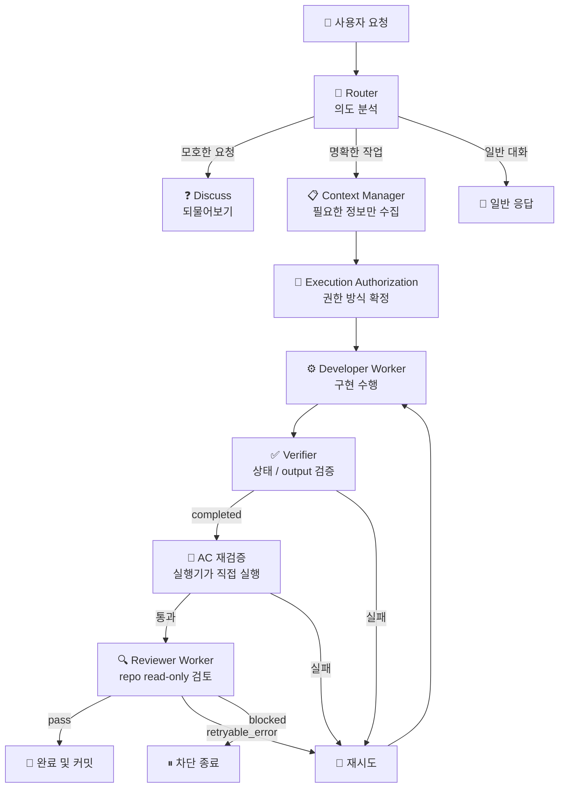

# dev-start 요약

`dev-start`는 개발을 바로 시작하기 전에 요청을 정리하고, 필요한 문서를 좁혀 읽고, step을 설계하고, 준비된 phase는 실행기까지 연결하는 하네스성 skill이다.

지금 이 Repo 기준으로 보면 `router -> context -> authorization -> developer -> verifier/AC -> reviewer -> commit` 흐름으로 움직인다. 이 문서는 상세 사용법이 아니라, 나중에 다시 봤을 때 "아 지금 이런 구조였지"를 빠르게 떠올리기 위한 요약 문서다.

## 전체 흐름 요약

## 단계별 역할

### 1. Router

현재는 별도 `router` 코드 파일이 있는 구조는 아니다. 대신 `dev-start`의 `SKILL.md` 안에서 `Explore -> Discuss -> Step Design -> File Drafting -> Execution Authorization -> Execution` 규칙으로 요청을 분기한다.

- 요구사항이 모호하면 바로 구현하지 않고 discuss로 돌린다.
- 계획만 필요한지, 실제 step 실행까지 들어갈지 여기서 갈린다.
- 일반 대화성 요청은 execution loop로 보내지 않는다.

### 2. Context Manager

전체 코드베이스를 다 넣지 않고, 현재 step에 필요한 문서만 모아서 developer에게 넘긴다.

- feature 문서 5종을 우선 읽는다.
- step 문서에 직접 언급된 루트 문서만 추가로 읽는다.
- 이전 step은 전체 이력이 아니라 완료된 step의 `summary`만 컨텍스트에 합친다.

현재 구현상 이 역할은 `step_context`가 담당한다.

### 3. Developer Worker

실제 구현을 수행하는 역할이다.

- 현재 step만 구현한다.
- 수정 가능 경로 밖으로 나가지 않는다.
- Acceptance Criteria를 직접 실행해 본다.
- step 상태를 `completed`, `error`, `blocked` 중 하나로 갱신하고 필요한 필드를 남긴다.

현재 구현상 이 역할은 `developer_guardrails` + `developer_worker` 조합으로 동작한다.

### 4. Verifier / AC 재검증

developer가 `completed`라고 썼다고 바로 끝나지 않는다. 실행기가 결과를 다시 검증한다.

- `step_verifier`가 상태와 output 형식을 먼저 확인한다.
- `completed`면 실행기가 Acceptance Criteria를 직접 다시 실행한다.
- AC 결과는 `stepN-ac-output.json`으로 기록된다.
- verifier, AC 재검증 중 하나라도 실패하면 다음 시도로 되돌린다.

즉 완료 판정 기준은 "모델이 그렇게 말했다"가 아니라 "실행기 검증을 통과했다"에 가깝다.

### 5. Reviewer Worker

developer가 만든 결과를 read-only 관점에서 한 번 더 본다.

- 변경 경로, output, AC 결과를 바탕으로 실제 repo 파일을 read-only로 확인한다.
- correctness, regression, test 누락, 명백한 규칙 위반을 중심으로 판단한다.
- `pass`, `retryable_error`, `blocked` 중 하나를 반환한다.

현재 구현상 이 역할은 `reviewer_guardrails` + `reviewer_worker` 조합으로 동작한다.

### 6. 완료 / 재시도 / 차단

하네스는 한 번 실행하고 끝나는 구조가 아니라, 실패 사유를 다음 시도 컨텍스트에 넣어 다시 돌리는 루프에 가깝다.

- verifier 실패 -> 재시도
- AC 재검증 실패 -> 재시도
- reviewer `retryable_error` -> 재시도
- reviewer `blocked` -> 즉시 차단 종료
- 모두 통과한 경우에만 완료와 커밋으로 간다

## 현재 Repo의 역할별 구성

- Router: `.codex/skills/dev-start/SKILL.md`의 `Explore / Discuss / Step Design / File Drafting / Execution Authorization / Execution`
- Context Manager: `.codex/skills/dev-start/scripts/step_context.py`
- Developer Worker: `.codex/skills/dev-start/scripts/developer_guardrails.py`, `.codex/skills/dev-start/scripts/developer_worker.py`
- Verifier / AC 재검증: `.codex/skills/dev-start/scripts/step_verifier.py`, `.codex/skills/dev-start/scripts/acceptance_runner.py`
- Reviewer Worker: `.codex/skills/dev-start/scripts/reviewer_guardrails.py`, `.codex/skills/dev-start/scripts/reviewer_worker.py`
- Orchestration: `.codex/skills/dev-start/scripts/execute.py`
